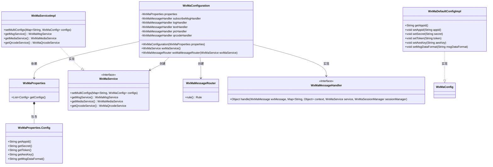
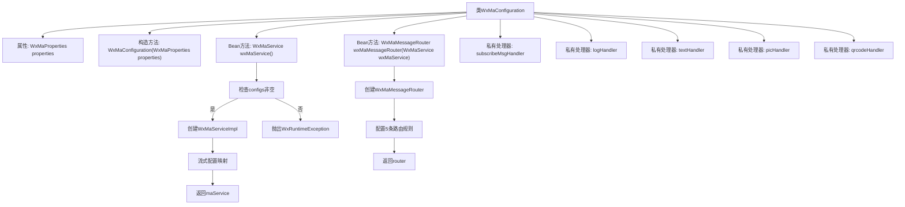
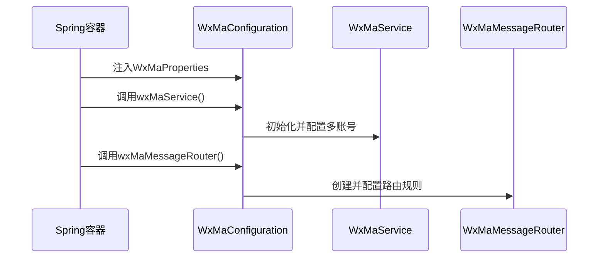

# 基础信息

|      |      |
|------|------|
| 名称 | WxMaConfiguration |
| 编码语言 | .java |
| 代码路径 | weixin-java-miniapp-demo/src/main/java/com/github/binarywang/demo/wx/miniapp/config/WxMaConfiguration.java |
| 包名 | com.github.binarywang.demo.wx.miniapp.config |
| 依赖项 | ['cn.binarywang.wx.miniapp.api.WxMaService', 'cn.binarywang.wx.miniapp.api.impl.WxMaServiceImpl', 'cn.binarywang.wx.miniapp.bean.WxMaKefuMessage', 'cn.binarywang.wx.miniapp.bean.WxMaSubscribeMessage', 'cn.binarywang.wx.miniapp.config.impl.WxMaDefaultConfigImpl', 'cn.binarywang.wx.miniapp.config.impl.WxMaRedisConfigImpl', 'cn.binarywang.wx.miniapp.message.WxMaMessageHandler', 'cn.binarywang.wx.miniapp.message.WxMaMessageRouter', 'com.google.common.collect.Lists', 'lombok.extern.slf4j.Slf4j', 'me.chanjar.weixin.common.bean.result.WxMediaUploadResult', 'me.chanjar.weixin.common.error.WxErrorException', 'me.chanjar.weixin.common.error.WxRuntimeException', 'org.springframework.beans.factory.annotation.Autowired', 'org.springframework.boot.context.properties.EnableConfigurationProperties', 'org.springframework.context.annotation.Bean', 'org.springframework.context.annotation.Configuration', 'redis.clients.jedis.JedisPool', 'java.io.File', 'java.util.List', 'java.util.stream.Collectors'] |
| 概述说明 | 微信小程序配置类，初始化服务与消息路由，处理订阅、文本、图片和二维码消息。 |

# 说明

这是一个微信小程序后端服务的配置类，主要功能包括初始化微信小程序服务和多账号配置，以及消息路由处理。类通过构造函数注入配置属性，检查配置有效性后创建微信小程序服务实例，并为不同消息类型（如订阅消息、文本、图片、二维码）配置对应的处理器。每个处理器负责处理特定类型的消息，例如记录日志、发送客服消息、上传图片或生成二维码等。配置类确保服务能正确处理各种微信小程序消息并作出相应回复。

# 类列表 Class Summary

| 名称   | 类型  | 说明 |
|-------|------|-------------|
| WxMaConfiguration | class | 这是一个微信小程序配置类，包含WxMaService和WxMaMessageRouter的Bean定义，处理订阅消息、文本、图片和二维码等消息类型。 |

## 类 WxMaConfiguration

|      |      |
|------|------|
| 访问范围 | @Slf4j;@Configuration;@EnableConfigurationProperties(WxMaProperties.class);public |
| 类型 | class |
| 名称 | WxMaConfiguration |
| 说明 | 这是一个微信小程序配置类，包含WxMaService和WxMaMessageRouter的Bean定义，处理订阅消息、文本、图片和二维码等消息类型。 |

### UML类图

这段代码是一个微信小程序的后端配置类，主要功能包括初始化微信小程序服务(WxMaService)和消息路由器(WxMaMessageRouter)。WxMaConfiguration类通过@Configuration注解表明这是一个配置类，它会读取WxMaProperties中的配置信息来初始化WxMaService，并创建消息路由器来处理不同类型的微信消息（如订阅消息、文本、图片、二维码等）。类图中展示了核心类及其关系，包括配置类、属性类、服务接口及其实现、消息处理器接口等，体现了Spring配置类和微信SDK的集成方式。

### 内部方法调用关系图

这段代码是微信小程序后端的Spring Boot配置类，主要完成两个核心功能：1) 初始化多账号的小程序服务(WxMaService)，通过流式处理将配置转换为内部数据结构；2) 构建消息路由(WxMaMessageRouter)，配置5种消息处理器来处理订阅消息、日志记录、文本、图片和二维码等不同类型的消息。代码采用建造者模式配置消息，并通过异常处理确保配置合法性，整体结构清晰体现了Spring的依赖注入特性。

### 字段列表 Field List

| 名称  | 类型  | 说明 |
|-------|-------|------|
| logHandler = (wxMessage, context, service, sessionManager) -> {        log.info("收到消息：" + wxMessage.toString());        service.getMsgService().sendKefuMsg(WxMaKefuMessage.newTextBuilder().content("收到信息为：" + wxMessage.toJson())            .toUser(wxMessage.getFromUser()).build());        return null;    } | WxMaMessageHandler | 定义微信小程序消息处理逻辑：记录接收消息内容并通过客服接口返回消息JSON给发送者。 |
| textHandler = (wxMessage, context, service, sessionManager) -> {        service.getMsgService().sendKefuMsg(WxMaKefuMessage.newTextBuilder().content("回复文本消息")            .toUser(wxMessage.getFromUser()).build());        return null;    } | WxMaMessageHandler | 这段代码定义了一个微信小程序消息处理器，用于回复用户文本消息。当收到用户消息时，它会通过客服接口向用户发送预设的文本回复内容。 |
| picHandler = (wxMessage, context, service, sessionManager) -> {        try {            WxMediaUploadResult uploadResult = service.getMediaService()                .uploadMedia("image", "png",                    ClassLoader.getSystemResourceAsStream("tmp.png"));            service.getMsgService().sendKefuMsg(                WxMaKefuMessage                    .newImageBuilder()                    .mediaId(uploadResult.getMediaId())                    .toUser(wxMessage.getFromUser())                    .build());        } catch (WxErrorException e) {            e.printStackTrace();        }        return null;    } | WxMaMessageHandler | 定义微信小程序图片消息处理器，上传临时图片并发送客服消息给用户，异常时打印错误。 |
| subscribeMsgHandler = (wxMessage, context, service, sessionManager) -> {        service.getMsgService().sendSubscribeMsg(WxMaSubscribeMessage.builder()            .templateId("此处更换为自己的模板id")            .data(Lists.newArrayList(                new WxMaSubscribeMessage.MsgData("keyword1", "339208499")))            .toUser(wxMessage.getFromUser())            .build());        return null;    } | WxMaMessageHandler | 这是一个微信小程序消息处理代码，用于发送订阅消息。使用模板ID和关键词数据构建消息，并发送给指定用户。 |
| properties | WxMaProperties | 私有不可变的微信小程序配置属性对象。 |
| qrcodeHandler = (wxMessage, context, service, sessionManager) -> {        try {            final File file = service.getQrcodeService().createQrcode("123", 430);            WxMediaUploadResult uploadResult = service.getMediaService().uploadMedia("image", file);            service.getMsgService().sendKefuMsg(                WxMaKefuMessage                    .newImageBuilder()                    .mediaId(uploadResult.getMediaId())                    .toUser(wxMessage.getFromUser())                    .build());        } catch (WxErrorException e) {            e.printStackTrace();        }        return null;    } | WxMaMessageHandler | 处理微信小程序消息，生成二维码并上传为图片，通过客服消息发送给用户。异常时打印错误。 |

### 方法列表

| 名称  | 类型  | 说明 |
|-------|-------|------|
| wxMaService | WxMaService | 创建微信小程序服务实例，检查配置后初始化多账号配置，包括appid、密钥等参数，未配置则抛出异常提示。 |
| wxMaMessageRouter | WxMaMessageRouter | 创建微信小程序消息路由，配置处理订阅、文本、图片和二维码消息的处理器，同步处理并返回路由实例。 |

