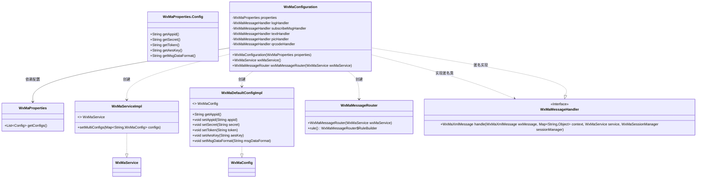
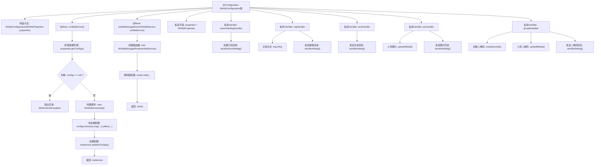

# 基础信息

|      |      |
|------|------|
| 名称 | WxMaConfiguration |
| 编码语言 | .java |
| 代码路径 | weixin-java-miniapp-demo/src/main/java/com/github/binarywang/demo/wx/miniapp/config/WxMaConfiguration.java |
| 包名 | com.github.binarywang.demo.wx.miniapp.config |
| 依赖项 | ['cn.binarywang.wx.miniapp.api.WxMaService', 'cn.binarywang.wx.miniapp.api.impl.WxMaServiceImpl', 'cn.binarywang.wx.miniapp.bean.WxMaKefuMessage', 'cn.binarywang.wx.miniapp.bean.WxMaSubscribeMessage', 'cn.binarywang.wx.miniapp.config.impl.WxMaDefaultConfigImpl', 'cn.binarywang.wx.miniapp.config.impl.WxMaRedisConfigImpl', 'cn.binarywang.wx.miniapp.message.WxMaMessageHandler', 'cn.binarywang.wx.miniapp.message.WxMaMessageRouter', 'com.google.common.collect.Lists', 'lombok.extern.slf4j.Slf4j', 'me.chanjar.weixin.common.bean.result.WxMediaUploadResult', 'me.chanjar.weixin.common.error.WxErrorException', 'me.chanjar.weixin.common.error.WxRuntimeException', 'org.springframework.beans.factory.annotation.Autowired', 'org.springframework.boot.context.properties.EnableConfigurationProperties', 'org.springframework.context.annotation.Bean', 'org.springframework.context.annotation.Configuration', 'redis.clients.jedis.JedisPool', 'java.io.File', 'java.util.List', 'java.util.stream.Collectors'] |
| 概述说明 | 此代码配置了微信小程序服务。它定义了两个核心Bean：一个用于配置小程序多实例服务（WxMaService），根据属性文件中的配置列表进行初始化；另一个定义了消息路由规则（WxMaMessageRouter），根据消息内容类型（如文本、图片）分发到对应的处理器。处理器负责处理订阅消息、记录日志、回复文本、发送图片或二维码等具体业务逻辑。 |

# 说明

这是一个名为WxMaConfiguration的Spring配置类，它用于配置和集成微信小程序的相关服务。该类通过构造函数自动注入WxMaProperties配置属性。它定义了两个核心Bean。第一个Bean是WxMaService，它根据WxMaProperties中提供的多个小程序配置列表初始化一个多配置的微信小程序服务实例，如果配置列表为空则会抛出运行时异常。第二个Bean是WxMaMessageRouter，它是一个消息路由器，其规则定义了如何处理不同类型的用户消息：所有消息先经过一个记录日志的处理器，然后根据消息内容（如“订阅消息”、“文本”、“图片”、“二维码”）分别路由到对应的处理器。这些处理器会执行诸如发送客服消息、订阅消息或上传并回复媒体文件等具体操作。整个配置完成了微信小程序后端消息接收与响应的基本流程搭建。

# 类列表 Class Summary

| 名称   | 类型  | 说明 |
|-------|------|-------------|
| WxMaConfiguration | class | 该代码配置了微信小程序服务，包括设置多小程序配置和定义消息路由器以处理不同类型消息。 |


## 类 WxMaConfiguration

|      |      |
|------|------|
| 访问范围 | @Slf4j;@Configuration;@EnableConfigurationProperties(WxMaProperties.class);public |
| 类型 | class |
| 名称 | WxMaConfiguration |
| 说明 | 该代码配置了微信小程序服务，包括设置多小程序配置和定义消息路由器以处理不同类型消息。 |


### UML类图



这段代码是一个Spring Boot配置类，主要用于配置微信小程序服务。WxMaConfiguration类通过依赖注入获取配置属性，在wxMaService()方法中创建并配置微信小程序服务实例，将多个小程序配置映射为配置对象。在wxMaMessageRouter()方法中创建消息路由器，并配置了多个消息处理规则，包括日志记录、订阅消息、文本消息、图片消息和二维码消息的处理逻辑。整个配置类实现了微信小程序服务的初始化和消息路由的配置。

```mermaid
sequenceDiagram
    participant SpringContainer
    participant Config as WxMaConfiguration
    participant Properties as WxMaProperties
    participant MaService as WxMaServiceImpl
    participant Configs as WxMaDefaultConfigImpl
    participant Router as WxMaMessageRouter
    
    SpringContainer->>Config: 创建WxMaConfiguration
    Config->>Properties: 依赖注入WxMaProperties
    SpringContainer->>Config: 调用wxMaService()
    Config->>Properties: getConfigs()
    Properties-->>Config: 返回configs列表
    alt configs == null
        Config-->>SpringContainer: 抛出WxRuntimeException
    else configs有效
        Config->>MaService: 创建WxMaServiceImpl
        loop 遍历每个config
            Config->>Configs: 创建WxMaDefaultConfigImpl
            Config->>Configs: 设置appid/secret/token等
        end
        Config->>MaService: setMultiConfigs(configMap)
        Config-->>SpringContainer: 返回WxMaService实例
    end
    
    SpringContainer->>Config: 调用wxMaMessageRouter(wxMaService)
    Config->>Router: 创建WxMaMessageRouter
    Router->>Router: 配置消息处理规则
    Config-->>SpringContainer: 返回WxMaMessageRouter
```

时序图展示了Spring容器初始化WxMaConfiguration配置类的完整过程。首先容器创建配置类并注入属性配置，然后调用wxMaService()方法创建微信小程序服务实例，过程中会验证配置有效性并逐个创建配置对象。最后调用wxMaMessageRouter()方法创建消息路由器并配置处理规则。整个过程体现了依赖注入和Bean创建的生命周期，确保了微信小程序服务的正确初始化和消息处理链路的建立。


### 内部方法调用关系图



这是一个微信小程序配置类，主要用于初始化微信小程序服务和消息路由器。通过构造函数注入配置属性，创建微信小程序服务实例并配置多个小程序配置，然后创建消息路由器并设置多种消息处理规则。每个消息处理器分别处理订阅消息、日志记录、文本消息、图片消息和二维码消息，实现了完整的微信小程序消息处理流程。

### 字段列表 Field List

| 名称  | 类型  | 说明 |
|-------|-------|------|
| textHandler = (wxMessage, context, service, sessionManager) -> {        service.getMsgService().sendKefuMsg(WxMaKefuMessage.newTextBuilder().content("回复文本消息")            .toUser(wxMessage.getFromUser()).build());        return null;    } | WxMaMessageHandler | 这段代码是一个私有的消息处理器，当接收到文本消息时，它会自动向发送消息的用户回复一条预设的文本内容。 |
| qrcodeHandler = (wxMessage, context, service, sessionManager) -> {        try {            final File file = service.getQrcodeService().createQrcode("123", 430);            WxMediaUploadResult uploadResult = service.getMediaService().uploadMedia("image", file);            service.getMsgService().sendKefuMsg(                WxMaKefuMessage                    .newImageBuilder()                    .mediaId(uploadResult.getMediaId())                    .toUser(wxMessage.getFromUser())                    .build());        } catch (WxErrorException e) {            e.printStackTrace();        }        return null;    } | WxMaMessageHandler | 该代码是一个微信小程序消息处理器，用于生成二维码并发送给用户。当收到消息时，它调用服务创建二维码图片，上传至微信服务器获取媒体ID，最后以客服消息形式将图片发送回用户。整个过程包含异常处理。 |
| logHandler = (wxMessage, context, service, sessionManager) -> {        log.info("收到消息：" + wxMessage.toString());        service.getMsgService().sendKefuMsg(WxMaKefuMessage.newTextBuilder().content("收到信息为：" + wxMessage.toJson())            .toUser(wxMessage.getFromUser()).build());        return null;    } | WxMaMessageHandler | 该代码段定义了一个微信小程序消息处理器logHandler，用于记录收到的消息内容，并通过客服接口向发送者回复一条包含原始消息JSON的文本消息。 |
| subscribeMsgHandler = (wxMessage, context, service, sessionManager) -> {        service.getMsgService().sendSubscribeMsg(WxMaSubscribeMessage.builder()            .templateId("此处更换为自己的模板id")            .data(Lists.newArrayList(                new WxMaSubscribeMessage.MsgData("keyword1", "339208499")))            .toUser(wxMessage.getFromUser())            .build());        return null;    } | WxMaMessageHandler | 这是一个微信小程序的消息处理器，当用户发送消息时，它会向该用户发送一条订阅消息。消息使用指定的模板，并包含一个关键词数据。 |
| picHandler = (wxMessage, context, service, sessionManager) -> {        try {            WxMediaUploadResult uploadResult = service.getMediaService()                .uploadMedia("image", "png",                    ClassLoader.getSystemResourceAsStream("tmp.png"));            service.getMsgService().sendKefuMsg(                WxMaKefuMessage                    .newImageBuilder()                    .mediaId(uploadResult.getMediaId())                    .toUser(wxMessage.getFromUser())                    .build());        } catch (WxErrorException e) {            e.printStackTrace();        }        return null;    } | WxMaMessageHandler | 该代码定义了一个微信小程序消息处理器，用于接收图片消息并自动回复一张预置的图片。具体流程为：当收到用户消息时，从系统资源中加载一张图片上传至微信服务器，然后将获取到的媒体ID通过客服消息接口发送回给用户，以此实现自动回复图片的功能。若过程中出现异常，则会进行错误打印。 |
| properties | WxMaProperties | 声明一个私有不可变的WxMaProperties属性。 |

### 方法列表

| 名称  | 类型  | 说明 |
|-------|-------|------|
| wxMaService | WxMaService | 定义微信小程序服务的Bean。检查配置列表是否为空，若空则抛出运行时异常。根据配置列表创建服务实例，设置多个配置项，映射每个配置的appid、secret、token、aesKey和msgDataFormat，最后返回配置好的服务对象。 |
| wxMaMessageRouter | WxMaMessageRouter | 该代码定义了微信小程序消息路由规则，根据用户发送的不同内容（如"订阅消息"、"文本"等）调用对应的处理器。配置包括同步处理和日志记录。 |


