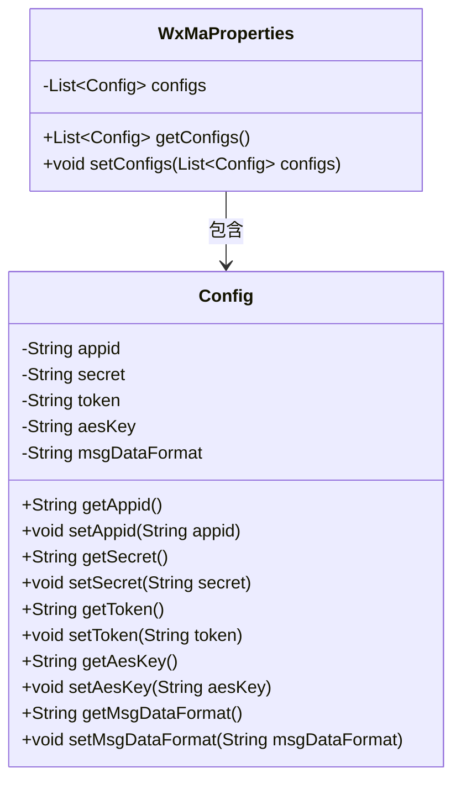
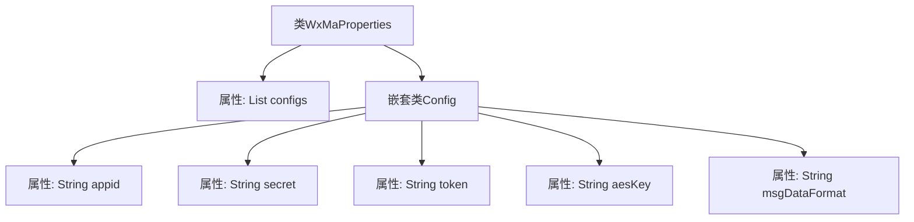

# 基础信息

|      |      |
|------|------|
| 名称 | WxMaProperties |
| 编码语言 | .java |
| 代码路径 | weixin-java-miniapp-demo/src/main/java/com/github/binarywang/demo/wx/miniapp/config/WxMaProperties.java |
| 包名 | com.github.binarywang.demo.wx.miniapp.config |
| 依赖项 | ['java.util.List', 'org.springframework.boot.context.properties.ConfigurationProperties', 'lombok.Data'] |
| 概述说明 | WxMaProperties类包含微信小程序配置列表，每个配置项有appid、secret、token、aesKey和msgDataFormat字段。 |

# 说明

这是一个微信小程序配置属性的Java类定义。主类WxMaProperties使用@ConfigurationProperties注解绑定以"wx.miniapp"为前缀的配置，包含一个Config类型的列表configs。Config内部类定义了小程序相关配置项：appid（小程序ID）、secret（小程序密钥）、token（消息服务器令牌）、aesKey（消息加密密钥）、msgDataFormat（消息格式，支持XML或JSON）。所有字段都通过Lombok的@Data注解自动生成getter/setter方法。

# 类列表 Class Summary

| 名称   | 类型  | 说明 |
|-------|------|-------------|
| WxMaProperties | class | WxMaProperties类定义微信小程序配置属性，包含多个Config对象，每个Config对象有appid、secret、token、aesKey和msgDataFormat字段。 |

## 类 WxMaProperties

|      |      |
|------|------|
| 访问范围 | @Data;@ConfigurationProperties(prefix = "wx.miniapp");public |
| 类型 | class |
| 名称 | WxMaProperties |
| 说明 | WxMaProperties类定义微信小程序配置属性，包含多个Config对象，每个Config对象有appid、secret、token、aesKey和msgDataFormat字段。 |

### UML类图

这段代码定义了一个微信小程序配置类WxMaProperties，包含一个嵌套的Config配置类。WxMaProperties使用@ConfigurationProperties注解绑定"wx.miniapp"前缀的配置，其核心是维护一个Config对象的列表。每个Config对象存储小程序的appid、secret、token、aesKey和msgDataFormat等关键配置项，通过Lombok的@Data注解自动生成getter/setter方法。类图清晰展示了WxMaProperties对Config的聚合关系，体现了配置信息的层级结构。

### 内部方法调用关系图

这段代码定义了一个Spring Boot配置类WxMaProperties，用于管理微信小程序的多账号配置。核心是嵌套的Config类，包含appid、secret、token等关键认证字段，通过@ConfigurationProperties绑定"wx.miniapp"前缀的配置。流程图展示了主类与嵌套类的层级关系，以及Config类中5个字符串类型配置项的组成结构。

### 字段列表 Field List

| 名称  | 类型  | 说明 |
|-------|-------|------|
| configs | List<Config> | 私有配置列表。 |

### 方法列表

| 名称  | 类型  | 说明 |
|-------|-------|------|

