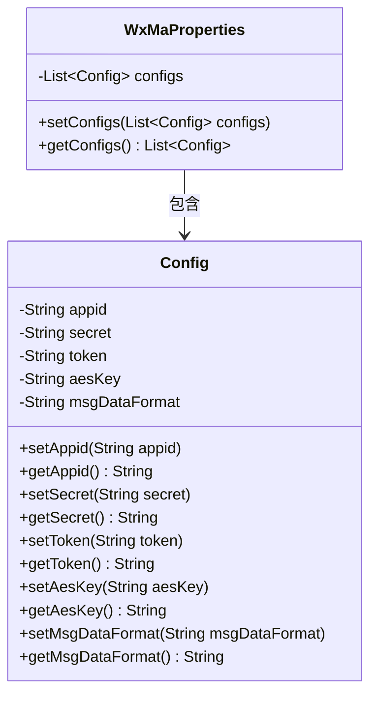
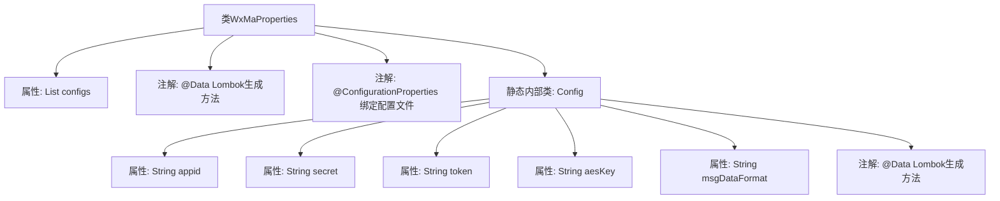

# 基础信息

|      |      |
|------|------|
| 名称 | WxMaProperties |
| 编码语言 | .java |
| 代码路径 | weixin-java-miniapp-demo/src/main/java/com/github/binarywang/demo/wx/miniapp/config/WxMaProperties.java |
| 包名 | com.github.binarywang.demo.wx.miniapp.config |
| 依赖项 | ['java.util.List', 'org.springframework.boot.context.properties.ConfigurationProperties', 'lombok.Data'] |
| 概述说明 | WxMaProperties类定义微信小程序配置属性，包含appid、secret、token、aesKey和msgDataFormat等关键配置项。 |

# 说明

这个代码定义了一个名为WxMaProperties的Java类，它是一个配置属性类，其前缀为“wx.miniapp”。它包含一个名为configs的列表，列表中的元素是Config内部类。Config类定义了微信小程序的核心配置属性，具体包括小程序的appid、密钥secret、服务器验证token、消息加密密钥aesKey以及消息数据格式msgDataFormat。这些属性用于配置与微信小程序服务端的连接和消息处理。

# 类列表 Class Summary

| 名称   | 类型  | 说明 |
|-------|------|-------------|
| WxMaProperties | class | 微信小程序配置属性类，包含appid、secret、token、aesKey和msgDataFormat等字段，支持多配置项。 |

## 类 WxMaProperties

|      |      |
|------|------|
| 访问范围 | @Data;@ConfigurationProperties(prefix = "wx.miniapp");public |
| 类型 | class |
| 名称 | WxMaProperties |
| 说明 | 微信小程序配置属性类，包含appid、secret、token、aesKey和msgDataFormat等字段，支持多配置项。 |

### UML类图

这个类图展示了Java Spring Boot应用中用于微信小程序配置的类结构。WxMaProperties类作为主配置类，包含一个Config类型的列表用于存储多个小程序配置。Config作为静态内部类，封装了微信小程序的核心配置参数，包括appid、secret、token等。通过@Data注解自动生成的getter和setter方法简化了属性访问。这种设计支持多小程序配置管理，并与Spring的@ConfigurationProperties机制集成，便于从外部配置文件注入属性值。

### 内部方法调用关系图

这是一个微信小程序配置属性类，使用@ConfigurationProperties注解将配置文件以"wx.miniapp"为前缀的属性绑定到此类。类中包含一个Config静态内部类列表，每个Config对象存储小程序的appid、secret等配置信息。通过Lombok的@Data注解自动生成getter、setter等方法，简化代码编写。

### 字段列表 Field List

| 名称  | 类型  | 说明 |
|-------|-------|------|
| configs | List<Config> | 私有变量configs，类型为Config对象的列表。 |

### 方法列表

| 名称  | 类型  | 说明 |
|-------|-------|------|

