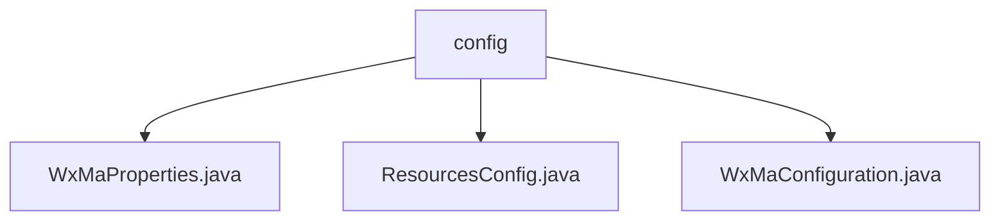

# 基础信息

|      |      |
|------|------|
| 名称 | config |
| 编码语言 | .java |
| 代码路径 | weixin-java-miniapp-demo/src/main/java/com/github/binarywang/demo/wx/miniapp/config |
| 包名 | docs.src.main.java.com.github.binarywang.demo.wx.miniapp.config |
| 概述说明 | 微信小程序Java配置类：WxMaProperties绑定小程序配置项；ResourcesConfig处理文件上传和跨域；WxMaConfiguration初始化服务并配置消息处理器。 |

# 说明

## 概述  
该模块是微信小程序后端的核心配置系统，负责整合小程序基础属性、文件资源管理和消息处理功能。通过Spring Boot配置属性绑定，支持多账号配置（如AppID/Secret等），类似微服务配置中心模式。关键数据结构包括WxMaProperties.Config（存储小程序凭证）和资源路径映射对。外部依赖Spring Boot配置体系、微信SDK和Lombok。例如WxMaProperties通过@ConfigurationProperties加载yml配置。

## 主要业务场景  
模块主要处理两类场景：初始化阶段加载多小程序配置并建立消息路由，运行时处理文件上传和跨域访问。采用"配置即服务"模式，例如ResourcesConfig将本地路径映射为Web资源。消息处理采用责任链模式，如WxMaConfiguration为不同消息类型（文本/图片）分配处理器。典型应用包括凭证校验、媒体文件管理和异步消息响应，类似事件总线的消息分发机制。

### 包内部结构视图

该流程图展示了微信小程序demo项目中config目录下的三个配置文件结构。WxMaProperties.java、ResourcesConfig.java和WxMaConfiguration.java三个文件都直接隶属于config目录，清晰地呈现了项目配置模块的文件组织方式。这种结构有助于开发者快速定位微信小程序相关配置的实现类。

# 文件列表

| 名称   | 类型  | 说明 |
|-------|------|-------------|
| [WxMaProperties.java](WxMaProperties.md) | file | WxMaProperties类包含微信小程序配置列表，每个配置项有appid、secret、token、aesKey和msgDataFormat字段。 |
| [ResourcesConfig.java](ResourcesConfig.md) | file | Java配置类实现本地文件路径映射与跨域支持，设置文件存储路径、前缀，并允许GET请求跨域访问。 |
| [WxMaConfiguration.java](WxMaConfiguration.md) | file | 微信小程序配置类，初始化服务与消息路由，处理订阅、文本、图片和二维码消息。 |

