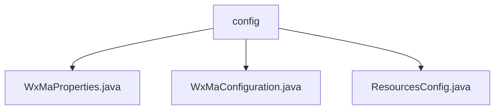

# 基础信息

|      |      |
|------|------|
| 名称 | config |
| 编码语言 | .java |
| 代码路径 | weixin-java-miniapp-demo/src/main/java/com/github/binarywang/demo/wx/miniapp/config |
| 包名 | docs.src.main.java.com.github.binarywang.demo.wx.miniapp.config |
| 概述说明 | 微信小程序后端配置类：WxMaProperties存储小程序核心配置如appid和secret；WxMaConfiguration初始化多配置小程序服务及消息路由，处理日志记录及各类消息响应；ResourcesConfig映射本地资源访问路径并支持跨域。 |

# 说明

## 概述
该模块是一个微信小程序后端的Spring Boot集成配置模块，负责统一管理小程序的多配置信息、初始化核心服务、处理用户消息路由，并提供资源访问支持。其接口规范主要基于Spring配置类对外暴露核心Bean，并通过约定前缀的属性类进行集中式配置。

关键数据结构包括`WxMaProperties.Config`内部类，它封装了单个小程序的`appid`、`secret`、`token`、`aesKey`及`msgDataFormat`等连接与安全属性。外部依赖项主要包括Spring Boot、WebMvc以及微信小程序Java SDK。例如通过`WxMaService`提供多小程序实例管理。

## 主要业务场景
模块合并了小程序配置加载、消息路由与资源服务的业务流程，形成了从接收到响应的完整处理视图。交互模式类似事件总线，消息路由器根据类型（如文本、图片）将用户请求分发至对应的处理器。

功能完整性体现在配置验证、消息日志、客服回复及媒体文件处理等环节。典型应用包括多小程序后台服务集成与前端资源文件访问。API类型涵盖配置Bean与MVC资源映射，集成案例如通过`WxMaMessageRouter`规则实现订阅消息的自动回复。

### 包内部结构视图

该流程图展示了微信小程序Demo项目中配置文件目录的结构关系。顶层节点为"config"目录，其下包含三个具体的配置文件：WxMaProperties.java、WxMaConfiguration.java和ResourcesConfig.java。这三个文件是平级关系，均直接隶属于config目录，共同构成了项目的基础配置模块。

# 文件列表

| 名称   | 类型  | 说明 |
|-------|------|-------------|
| [WxMaProperties.java](WxMaProperties.md) | file | WxMaProperties类定义微信小程序配置属性，包含appid、secret、token、aesKey和msgDataFormat等关键配置项。 |
| [WxMaConfiguration.java](WxMaConfiguration.md) | file | 此代码配置了微信小程序服务。它定义了两个核心Bean：一个用于配置小程序多实例服务（WxMaService），根据属性文件中的配置列表进行初始化；另一个定义了消息路由规则（WxMaMessageRouter），根据消息内容类型（如文本、图片）分发到对应的处理器。处理器负责处理订阅消息、记录日志、回复文本、发送图片或二维码等具体业务逻辑。 |
| [ResourcesConfig.java](ResourcesConfig.md) | file | 配置文件类实现WebMvc配置，映射本地文件上传路径为静态资源，并开启跨域支持，允许所有域名通过GET方法访问该路径下的资源。 |

