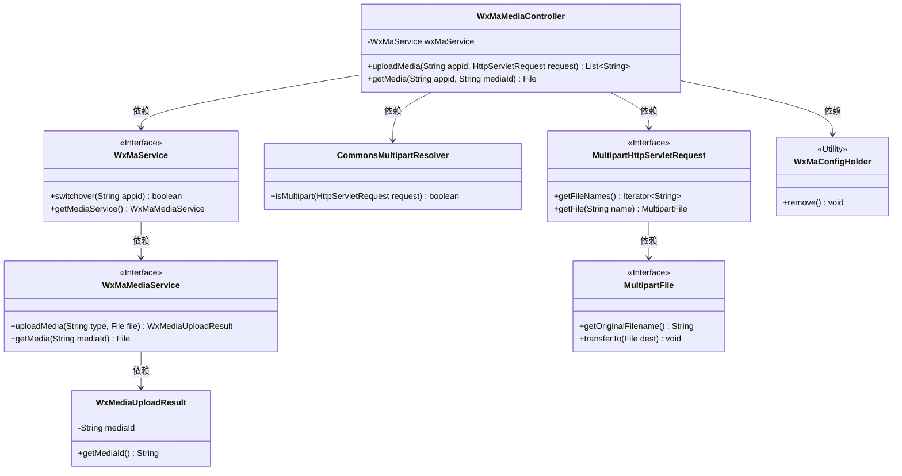
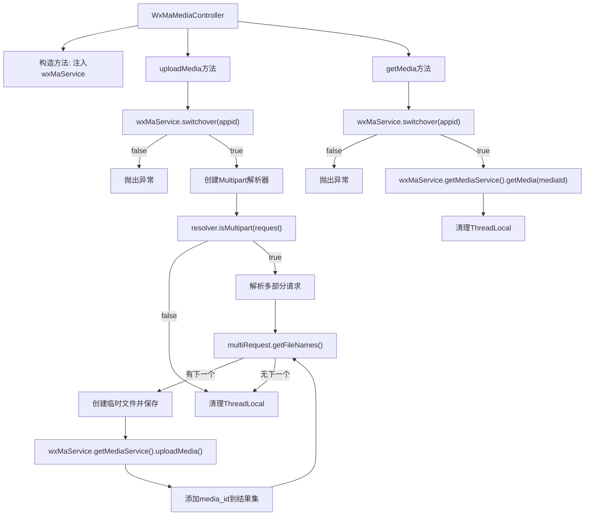
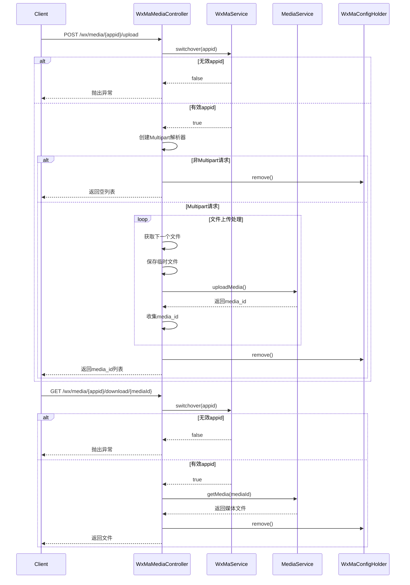

# 基础信息

|      |      |
|------|------|
| 名称 | WxMaMediaController |
| 编码语言 | .java |
| 代码路径 | weixin-java-miniapp-demo/src/main/java/com/github/binarywang/demo/wx/miniapp/controller/WxMaMediaController.java |
| 包名 | com.github.binarywang.demo.wx.miniapp.controller |
| 依赖项 | ['cn.binarywang.wx.miniapp.api.WxMaService', 'cn.binarywang.wx.miniapp.constant.WxMaConstants', 'cn.binarywang.wx.miniapp.util.WxMaConfigHolder', 'com.google.common.collect.Lists', 'com.google.common.io.Files', 'lombok.AllArgsConstructor', 'lombok.extern.slf4j.Slf4j', 'me.chanjar.weixin.common.bean.result.WxMediaUploadResult', 'me.chanjar.weixin.common.error.WxErrorException', 'org.springframework.web.bind.annotation', 'org.springframework.web.multipart.MultipartFile', 'org.springframework.web.multipart.MultipartHttpServletRequest', 'org.springframework.web.multipart.commons.CommonsMultipartResolver', 'javax.servlet.http.HttpServletRequest', 'java.io.File', 'java.io.IOException', 'java.util.Iterator', 'java.util.List'] |
| 概述说明 | 微信小程序素材控制器，提供上传和下载临时素材功能。上传需验证appid并处理多文件，返回media_id列表；下载需验证appid并返回素材文件。 |

# 说明

这是一个微信小程序媒体文件管理控制器类，包含上传和下载临时素材功能。上传接口接收appid和HTTP请求，验证配置后处理多文件上传，返回media_id列表。下载接口根据appid和mediaId获取媒体文件。两个操作均会清理ThreadLocal存储的配置信息。上传过程涉及临时文件创建和异常处理，下载过程直接返回文件对象。

# 类列表 Class Summary

| 名称   | 类型  | 说明 |
|-------|------|-------------|
| WxMaMediaController | class | WxMaMediaController处理微信小程序临时素材上传下载，包含上传返回media_id列表和下载返回文件功能，需校验appid有效性。 |

## 类 WxMaMediaController

|      |      |
|------|------|
| 访问范围 | @RestController;@AllArgsConstructor;@Slf4j;@RequestMapping("/wx/media/{appid}");public |
| 类型 | class |
| 名称 | WxMaMediaController |
| 说明 | WxMaMediaController处理微信小程序临时素材上传下载，包含上传返回media_id列表和下载返回文件功能，需校验appid有效性。 |

### UML类图

类图描述：该图展示了一个微信小程序素材管理控制器的类结构。WxMaMediaController通过WxMaService处理素材上传下载，依赖CommonsMultipartResolver解析多部分请求，使用MultipartHttpServletRequest获取上传文件，并通过WxMaMediaService与微信API交互。WxMaConfigHolder用于清理线程本地变量，各接口清晰地分离了不同层级的职责。

### 内部方法调用关系图

这段代码实现了一个微信小程序媒体文件管理控制器，包含上传临时素材和下载临时素材两个核心功能。上传流程会验证appid、解析多部分请求、处理多个文件上传并返回media_id列表；下载流程同样验证appid后通过media_id获取媒体文件。两个操作最后都会清理ThreadLocal存储的配置信息，确保线程安全。代码中包含了完善的错误处理和日志记录机制。

### 字段列表 Field List

| 名称  | 类型  | 说明 |
|-------|-------|------|
| wxMaService | WxMaService | 微信小程序服务实例，私有不可变。 |

### 方法列表

| 名称  | 类型  | 说明 |
|-------|-------|------|
| uploadMedia | List<String> | 这是一个处理文件上传的接口，验证appid后接收多文件，保存为临时文件并上传至微信服务器，返回媒体ID列表。 |
| getMedia | File | 该代码是一个GET接口，用于根据appid和mediaId下载媒体文件。首先检查appid有效性，无效则报错；有效则获取对应文件并清理ThreadLocal后返回。 |

