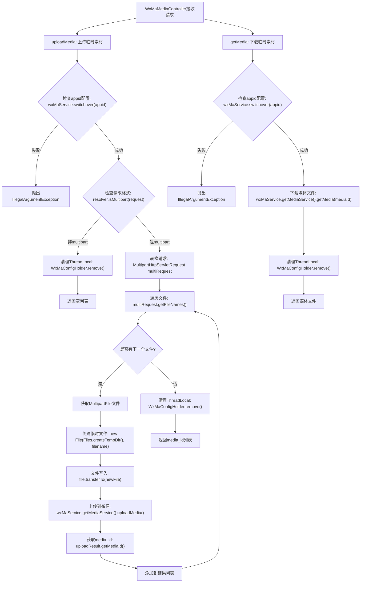

# 基础信息

|      |      |
|------|------|
| 名称 | WxMaMediaController |
| 编码语言 | .java |
| 代码路径 | weixin-java-miniapp-demo/src/main/java/com/github/binarywang/demo/wx/miniapp/controller/WxMaMediaController.java |
| 包名 | com.github.binarywang.demo.wx.miniapp.controller |
| 依赖项 | ['cn.binarywang.wx.miniapp.api.WxMaService', 'cn.binarywang.wx.miniapp.constant.WxMaConstants', 'cn.binarywang.wx.miniapp.util.WxMaConfigHolder', 'com.google.common.collect.Lists', 'com.google.common.io.Files', 'lombok.AllArgsConstructor', 'lombok.extern.slf4j.Slf4j', 'me.chanjar.weixin.common.bean.result.WxMediaUploadResult', 'me.chanjar.weixin.common.error.WxErrorException', 'org.springframework.web.bind.annotation', 'org.springframework.web.multipart.MultipartFile', 'org.springframework.web.multipart.MultipartHttpServletRequest', 'org.springframework.web.multipart.commons.CommonsMultipartResolver', 'javax.servlet.http.HttpServletRequest', 'java.io.File', 'java.io.IOException', 'java.util.Iterator', 'java.util.List'] |
| 概述说明 | 这是一个微信小程序临时素材管理控制器。包含上传和下载素材两个接口。上传接口处理多文件，返回media_id列表；下载接口根据media_id获取文件。执行前后会进行小程序配置切换和清理。 |

# 说明

这是一个基于Spring Boot的微信小程序媒体文件管理控制器。它包含两个核心接口。第一个接口通过HTTP POST请求上传临时素材，接收小程序标识appid和包含文件的HTTP请求，首先校验appid配置是否存在，然后处理多部分表单数据，将接收的文件保存为临时文件并调用微信服务上传，最终返回包含上传后media_id的列表。第二个接口通过HTTP GET请求下载临时素材，根据传入的小程序标识appid和媒体文件ID mediaId进行配置校验，然后调用微信服务获取对应的媒体文件并返回。两个接口在执行完毕后都会清理当前线程中的配置信息。

# 类列表 Class Summary

| 名称   | 类型  | 说明 |
|-------|------|-------------|
| WxMaMediaController | class | 这是一个微信小程序多媒体控制器，提供上传和下载临时素材的功能。上传支持多文件处理，验证应用配置后通过微信API上传并返回media_id。下载通过media_id获取文件。操作后会清理线程存储。 |


## 类 WxMaMediaController

|      |      |
|------|------|
| 访问范围 | @RestController;@AllArgsConstructor;@Slf4j;@RequestMapping("/wx/media/{appid}");public |
| 类型 | class |
| 名称 | WxMaMediaController |
| 说明 | 这是一个微信小程序多媒体控制器，提供上传和下载临时素材的功能。上传支持多文件处理，验证应用配置后通过微信API上传并返回media_id。下载通过media_id获取文件。操作后会清理线程存储。 |


### UML类图

```mermaid
classDiagram
    class WxMaMediaController {
        -WxMaService wxMaService
        +List~String~ uploadMedia(String appid, HttpServletRequest request) WxErrorException
        +File getMedia(String appid, String mediaId) WxErrorException
    }
    
    class WxMaService {
        +boolean switchover(String appid)
        +WxMaMediaService getMediaService()
    }
    
    class <<Interface>> WxMaMediaService {
        +WxMediaUploadResult uploadMedia(WxMaConstants.KefuMsgType type, File file) WxErrorException
        +File getMedia(String mediaId) WxErrorException
    }
    
    class WxMediaUploadResult {
        -String mediaId
        +String getMediaId()
    }
    
    class WxMaConstants {
        class KefuMsgType {
            <<enumeration>>
            IMAGE
            VOICE
            VIDEO
            THUMB
        }
    }
    
    class WxMaConfigHolder {
        +static void remove()
    }
    
    class CommonsMultipartResolver {
        +boolean isMultipart(HttpServletRequest request)
    }
    
    WxMaMediaController --> WxMaService : 依赖
    WxMaMediaController --> CommonsMultipartResolver : 使用
    WxMaMediaController --> WxMaConfigHolder : 调用
    WxMaService --> WxMaMediaService : 关联
    WxMaMediaService --> WxMediaUploadResult : 返回
    WxMaMediaController --> WxMaConstants : 引用
```

该类图展示了一个微信小程序媒体文件管理的控制器类结构。WxMaMediaController作为REST控制器，依赖WxMaService来处理微信相关业务逻辑。控制器提供了上传和下载临时素材的接口，通过WxMaService获取媒体服务实现具体的上传和下载操作。上传时使用CommonsMultipartResolver处理多部分请求，下载时直接调用媒体服务。整个过程中使用WxMaConfigHolder管理ThreadLocal配置，并在操作完成后清理资源。


### 内部方法调用关系图



该流程图展示了微信小程序媒体控制器处理上传和下载临时素材的完整流程。上传流程包含配置验证、请求格式检查、多文件循环处理以及微信API调用，最后清理ThreadLocal并返回结果。下载流程则相对简单，主要进行配置验证和微信API调用。两个流程都包含了异常处理和资源清理机制，确保系统的稳定性和安全性。

### 字段列表 Field List

| 名称  | 类型  | 说明 |
|-------|-------|------|
| wxMaService | WxMaService | 该代码定义了一个私有的不可变的微信小程序服务实例变量wxMaService。 |

### 方法列表

| 名称  | 类型  | 说明 |
|-------|-------|------|
| uploadMedia | List<String> | 该代码是一个处理文件上传的Java方法。它首先检查配置是否正确，然后解析上传的文件，将每个文件上传至微信媒体服务，并收集返回的媒体ID。处理完毕后清理配置信息，最终返回媒体ID列表。 |
| getMedia | File | 该Java方法是一个GET请求接口，用于根据appid和mediaId下载微信小程序媒体文件。首先检查appid配置是否存在，若存在则获取对应媒体文件，最后清理线程本地存储并返回文件。 |


