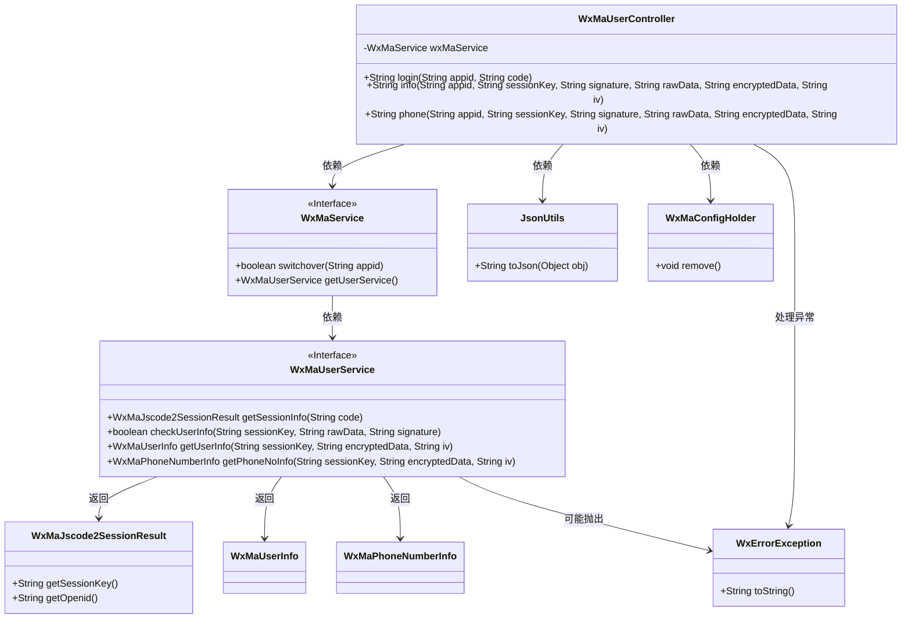

# 基础信息

|      |      |
|------|------|
| 名称 | WxMaUserController |
| 编码语言 | .java |
| 代码路径 | weixin-java-miniapp-demo/src/main/java/com/github/binarywang/demo/wx/miniapp/controller/WxMaUserController.java |
| 包名 | com.github.binarywang.demo.wx.miniapp.controller |
| 依赖项 | ['cn.binarywang.wx.miniapp.api.WxMaService', 'cn.binarywang.wx.miniapp.bean.WxMaJscode2SessionResult', 'cn.binarywang.wx.miniapp.bean.WxMaPhoneNumberInfo', 'cn.binarywang.wx.miniapp.bean.WxMaUserInfo', 'cn.binarywang.wx.miniapp.util.WxMaConfigHolder', 'com.github.binarywang.demo.wx.miniapp.utils.JsonUtils', 'lombok.AllArgsConstructor', 'lombok.extern.slf4j.Slf4j', 'me.chanjar.weixin.common.error.WxErrorException', 'org.apache.commons.lang3.StringUtils', 'org.springframework.web.bind.annotation.GetMapping', 'org.springframework.web.bind.annotation.PathVariable', 'org.springframework.web.bind.annotation.RequestMapping', 'org.springframework.web.bind.annotation.RestController'] |
| 概述说明 | 这是一个处理微信小程序用户相关请求的控制器。它包含三个主要接口：用户登录、获取用户信息和获取用户手机号。所有接口都依赖于微信服务进行身份验证和数据解密，并在操作前后进行线程本地资源的清理。 |

# 说明

这是一个处理微信小程序用户相关请求的控制器类。它提供了三个主要接口。第一个是用户登录接口，它接收小程序代码进行微信服务端会话获取，返回包含会话密钥和用户唯一标识的JSON数据。第二个接口用于获取用户基本信息，首先校验用户数据签名，然后解密并返回用户信息的JSON。第三个接口用于获取用户绑定的手机号信息，同样进行签名校验和解密后返回手机号信息的JSON。在每个接口处理过程中，都会先检查并切换对应小程序的配置，并在方法执行后清理相关的线程本地存储，以确保资源正确释放和数据隔离。

# 类列表 Class Summary

| 名称   | 类型  | 说明 |
|-------|------|-------------|
| WxMaUserController | class | 这是一个微信小程序后端控制器，用于处理用户登录、获取用户信息和手机号等操作。它包含三个接口：/login用于用户登录并获取会话信息；/info用于获取用户信息；/phone用于获取用户手机号。所有操作均进行安全校验和数据解密。 |


## 类 WxMaUserController

|      |      |
|------|------|
| 访问范围 | @RestController;@AllArgsConstructor;@Slf4j;@RequestMapping("/wx/user/{appid}");public |
| 类型 | class |
| 名称 | WxMaUserController |
| 说明 | 这是一个微信小程序后端控制器，用于处理用户登录、获取用户信息和手机号等操作。它包含三个接口：/login用于用户登录并获取会话信息；/info用于获取用户信息；/phone用于获取用户手机号。所有操作均进行安全校验和数据解密。 |


### UML类图



该类图描述了微信小程序用户管理控制器的结构。WxMaUserController作为REST控制器，依赖WxMaService接口来处理微信相关业务逻辑。控制器提供了三个主要接口：login用于用户登录获取会话信息，info用于获取用户基本信息，phone用于获取用户手机号信息。所有方法都通过WxMaService与微信API交互，并使用WxMaConfigHolder管理线程本地配置，确保在多租户环境下的数据隔离。异常处理和JSON序列化也是该控制器的重要功能组成部分。


### 内部方法调用关系图

```mermaid
graph TD
    A[“WxMaUserController接收请求”]
    B[“判断接口类型”]
    C[“login接口”]
    D[“info接口”]
    E[“phone接口”]
    F[“检查code参数”]
    G[“返回'empty jscode'”]
    H[“switchover(appid)”]
    I[“抛出IllegalArgumentException”]
    J[“getSessionInfo(code)”]
    K[“记录session信息”]
    L[“返回JSON(session)”]
    M[“捕获WxErrorException”]
    N[“记录错误并返回e.toString()”]
    O[“finally: WxMaConfigHolder.remove()”]
    P[“检查用户信息checkUserInfo”]
    Q[“返回'user check failed'”]
    R[“解密getUserInfo”]
    S[“返回JSON(userInfo)”]
    T[“解密getPhoneNoInfo”]
    U[“返回JSON(phoneNoInfo)”]
    
    A --> B
    B --> C
    B --> D
    B --> E
    
    C --> F
    F --是--> G
    F --否--> H
    H --失败--> I
    H --成功--> J
    J --异常--> M
    J --正常--> K
    K --> L
    M --> N
    L --> O
    N --> O
    
    D --> H
    H --失败--> I
    H --成功--> P
    P --失败--> Q
    P --成功--> R
    R --> S
    
    E --> H
    H --失败--> I
    H --成功--> P
    P --失败--> Q
    P --成功--> T
    T --> U
    
    Q --> O
    S --> O
    U --> O
```

这是一个微信小程序用户控制器，提供三个主要功能：用户登录、获取用户信息和获取用户手机号。代码首先检查appid配置的有效性，然后根据不同的接口执行相应的业务逻辑。登录接口需要验证code参数并获取session信息；用户信息和手机号接口需要验证用户数据签名和解密数据。所有接口最后都会清理ThreadLocal中的配置信息，确保线程安全。异常情况会返回相应的错误信息，正常流程则返回JSON格式的数据。

### 字段列表 Field List

| 名称  | 类型  | 说明 |
|-------|-------|------|
| wxMaService | WxMaService | 定义一个WxMaService类型的私有不可变成员变量wxMaService。 |

### 方法列表

| 名称  | 类型  | 说明 |
|-------|-------|------|
| login | String | 这是一个微信小程序登录接口。它接收appid和code参数，检查code有效性并验证appid配置。使用code换取用户的openid和session_key，并返回这些信息。处理过程中会捕获异常并清理线程本地存储。 |
| info | String | 这是一个微信小程序后端接口，用于获取和验证用户信息。它先检查appid配置，然后验证用户数据签名，最后解密并返回用户信息。接口会在完成处理后清理线程本地存储。 |
| phone | String | 这是一个微信小程序后端接口方法，用于获取用户手机号。其处理流程为：首先检查并切换微信服务配置；然后校验用户信息；最后解密数据并返回手机号信息。整个过程包含了必要的安全校验和数据清理。 |


