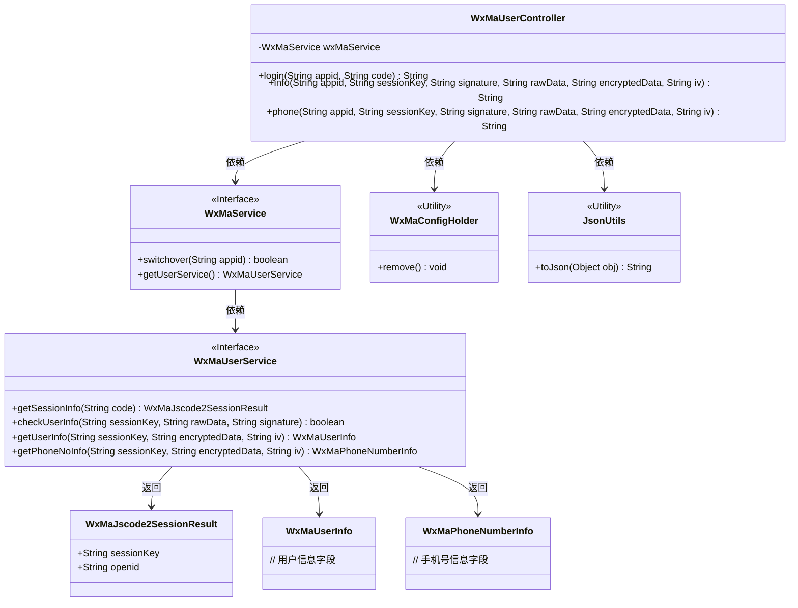
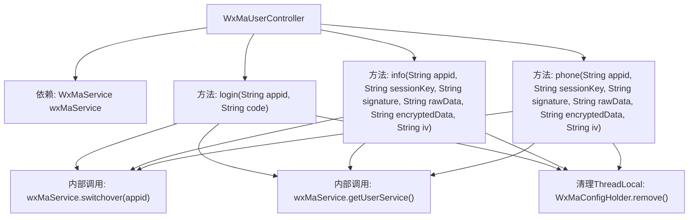
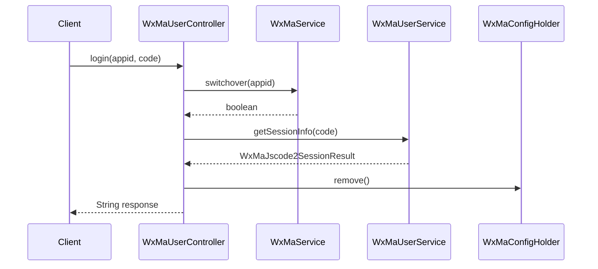

# 基础信息

|      |      |
|------|------|
| 名称 | WxMaUserController |
| 编码语言 | .java |
| 代码路径 | weixin-java-miniapp-demo/src/main/java/com/github/binarywang/demo/wx/miniapp/controller/WxMaUserController.java |
| 包名 | com.github.binarywang.demo.wx.miniapp.controller |
| 依赖项 | ['cn.binarywang.wx.miniapp.api.WxMaService', 'cn.binarywang.wx.miniapp.bean.WxMaJscode2SessionResult', 'cn.binarywang.wx.miniapp.bean.WxMaPhoneNumberInfo', 'cn.binarywang.wx.miniapp.bean.WxMaUserInfo', 'cn.binarywang.wx.miniapp.util.WxMaConfigHolder', 'com.github.binarywang.demo.wx.miniapp.utils.JsonUtils', 'lombok.AllArgsConstructor', 'lombok.extern.slf4j.Slf4j', 'me.chanjar.weixin.common.error.WxErrorException', 'org.apache.commons.lang3.StringUtils', 'org.springframework.web.bind.annotation.GetMapping', 'org.springframework.web.bind.annotation.PathVariable', 'org.springframework.web.bind.annotation.RequestMapping', 'org.springframework.web.bind.annotation.RestController'] |
| 概述说明 | 微信小程序用户控制器，提供登录、用户信息和手机号获取接口，验证appid和用户数据，返回JSON格式结果，每次请求后清理ThreadLocal。 |

# 说明

这是一个微信小程序用户管理控制器类，包含三个接口：登录接口接收appid和code参数，验证后返回用户会话信息；用户信息接口接收appid、sessionKey等参数，校验后返回解密后的用户信息；手机号接口同样接收appid等参数，校验后返回解密后的手机号信息。所有接口都会在操作完成后清理ThreadLocal存储的配置信息。

# 类列表 Class Summary

| 名称   | 类型  | 说明 |
|-------|------|-------------|
| WxMaUserController | class | 微信小程序用户控制器，提供登录、用户信息和手机号获取接口，验证appid和用户数据，返回JSON结果，使用后清理ThreadLocal。 |

## 类 WxMaUserController

|      |      |
|------|------|
| 访问范围 | @RestController;@AllArgsConstructor;@Slf4j;@RequestMapping("/wx/user/{appid}");public |
| 类型 | class |
| 名称 | WxMaUserController |
| 说明 | 微信小程序用户控制器，提供登录、用户信息和手机号获取接口，验证appid和用户数据，返回JSON结果，使用后清理ThreadLocal。 |

### UML类图

类图描述：
WxMaUserController是一个微信小程序用户相关的REST控制器，通过WxMaService与微信后台交互，提供登录、获取用户信息和手机号三个核心功能。控制器依赖WxMaService接口完成业务逻辑，其中WxMaService又依赖WxMaUserService接口实现具体用户操作。返回结果通过JsonUtils工具类序列化，并使用WxMaConfigHolder管理线程局部变量。整体设计遵循接口隔离原则，各组件职责明确，通过接口降低耦合度。

### 内部方法调用关系图

这段代码是一个微信小程序用户相关的Spring Boot控制器，包含三个核心接口：登录、获取用户信息和获取用户手机号。所有接口都先验证appid有效性，通过WxMaService进行微信API交互，并在最后清理ThreadLocal存储的配置。登录接口处理JS code换取session，用户信息接口验证并解密用户数据，手机号接口专门处理加密的手机号信息解密。每个方法都遵循"验证-处理-清理"的流程模式，确保线程安全性和数据一致性。

### 字段列表 Field List

| 名称  | 类型  | 说明 |
|-------|-------|------|
| wxMaService | WxMaService | 微信小程序服务实例（WxMaService）的私有不可变成员变量。 |

### 方法列表

| 名称  | 类型  | 说明 |
|-------|-------|------|
| login | String | 这是一个微信小程序登录接口，接收appid和code参数，验证code有效性后获取用户会话信息，返回session_key和openid，异常时返回错误信息，最后清理ThreadLocal。 |
| info | String | 该代码是一个微信小程序后端接口，用于验证用户信息并解密返回用户数据。首先检查appid配置，然后校验用户信息签名，最后解密数据并返回JSON格式的用户信息。 |
| phone | String | 获取微信用户手机号接口：校验appid和用户信息，解密手机号数据后返回。失败返回错误信息。 |

