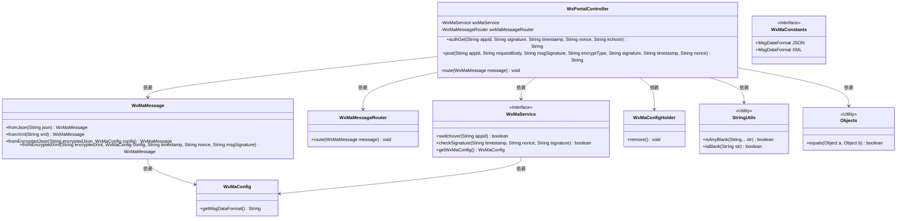
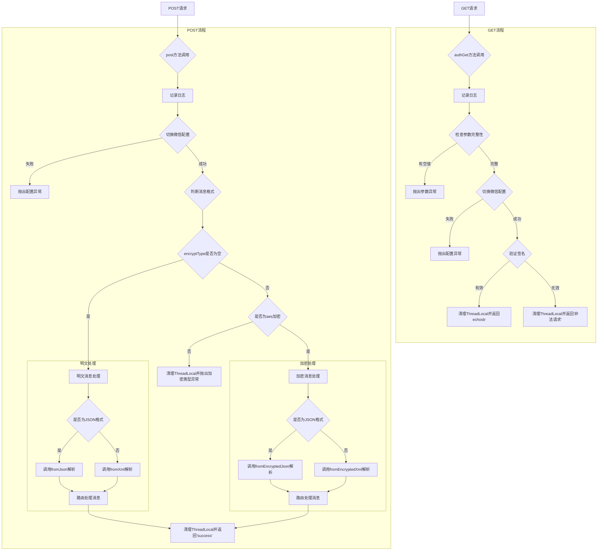
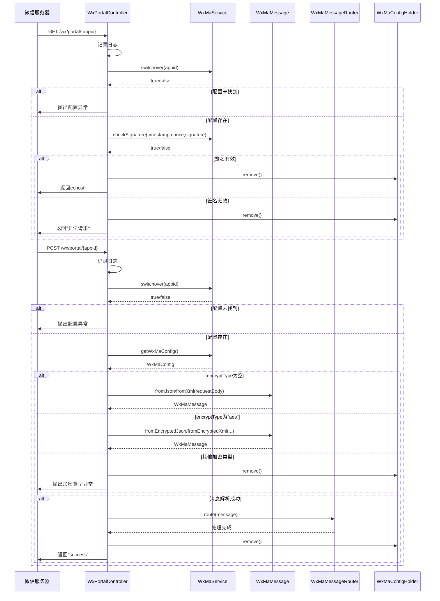
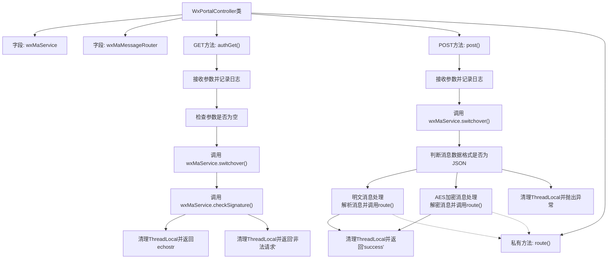

# 基础信息

|      |      |
|------|------|
| 名称 | WxPortalController |
| 编码语言 | .java |
| 代码路径 | weixin-java-miniapp-demo/src/main/java/com/github/binarywang/demo/wx/miniapp/controller/WxPortalController.java |
| 包名 | com.github.binarywang.demo.wx.miniapp.controller |
| 依赖项 | ['cn.binarywang.wx.miniapp.api.WxMaService', 'cn.binarywang.wx.miniapp.bean.WxMaMessage', 'cn.binarywang.wx.miniapp.constant.WxMaConstants', 'cn.binarywang.wx.miniapp.message.WxMaMessageRouter', 'cn.binarywang.wx.miniapp.util.WxMaConfigHolder', 'lombok.AllArgsConstructor', 'lombok.extern.slf4j.Slf4j', 'org.apache.commons.lang3.StringUtils', 'org.springframework.web.bind.annotation', 'java.util.Objects'] |
| 概述说明 | 这是一个处理微信小程序服务器请求的控制器类。它包含两个核心接口：一个用于验证服务器配置的GET请求，另一个用于处理用户消息的POST请求。控制器会根据请求参数和消息格式进行消息路由处理，并确保每次请求后清理线程本地存储。 |

# 说明

这是一个处理微信小程序服务器消息的控制器类。它包含两个核心方法：一个用于处理微信服务器的验证请求，通过校验签名参数并返回特定字符串来完成服务器验证；另一个用于处理用户发送的各类消息，支持明文和AES加密两种格式。处理流程包括检查应用ID配置、根据加密类型解析消息、将消息路由到相应的处理逻辑，并在每次请求后清理线程本地存储的配置。整个控制器负责与微信服务器进行通信，验证消息来源，并分发处理用户消息。

# 类列表 Class Summary

| 名称   | 类型  | 说明 |
|-------|------|-------------|
| WxPortalController | class | 这是一个微信小程序后台控制器，包含两个接口。GET接口处理微信服务器验证，接收signature、timestamp、nonce、echostr参数进行校验。POST接口处理用户消息，支持明文和AES加密格式，解析消息后路由处理，并清理线程本地存储。 |

## 类 WxPortalController

|      |      |
|------|------|
| 访问范围 | @RestController;@AllArgsConstructor;@RequestMapping("/wx/portal/{appid}");@Slf4j;public |
| 类型 | class |
| 名称 | WxPortalController |
| 说明 | 这是一个微信小程序后台控制器，包含两个接口。GET接口处理微信服务器验证，接收signature、timestamp、nonce、echostr参数进行校验。POST接口处理用户消息，支持明文和AES加密格式，解析消息后路由处理，并清理线程本地存储。 |

### UML类图

**流程图：**

**时序图：**

**类图描述：**
这是一个微信公众号消息处理的控制层类图，包含一个核心控制器WxPortalController，它依赖微信消息服务接口WxMaService进行配置切换和签名验证，依赖消息路由器WxMaMessageRouter进行消息分发。消息实体类WxMaMessage提供多种消息解析方法，配置类WxMaConfig存储消息格式设置，工具类StringUtils和Objects用于参数校验。整个结构展示了微信消息接收、验证、解析和路由的完整处理流程，通过ThreadLocal配置持有器WxMaConfigHolder确保线程安全。

### 内部方法调用关系图

这是一个微信公众号/小程序后台服务器验证和消息处理控制器的流程图。该控制器提供两个主要端点：GET方法用于微信服务器的URL验证，接收signature、timestamp等参数，验证通过后返回echostr完成配置；POST方法用于处理用户发送的消息，根据消息格式（JSON/XML）和加密类型（明文/AES）进行解析，然后通过消息路由器进行路由处理。所有操作完成后都会清理ThreadLocal资源，确保线程安全。

### 字段列表 Field List

| 名称  | 类型  | 说明 |
|-------|-------|------|
| wxMaService | WxMaService | 这是一个Java类中的私有成员变量，声明为final，类型是WxMaService，用于持有微信小程序服务的引用。 |
| wxMaMessageRouter | WxMaMessageRouter | 代码定义了一个微信小程序消息路由器的私有常量变量。 |

### 方法列表

| 名称  | 类型  | 说明 |
|-------|-------|------|
| post | String | 这是一个接收微信消息推送的HTTP接口。它处理明文和AES加密两种格式的请求，根据消息格式（JSON或XML）进行解析，并将解析后的消息路由到相应处理器。处理完成后返回"success"并清理线程本地存储。如果找不到对应的小程序配置或加密类型不可识别，则会抛出异常。 |
| authGet | String | 这是一个处理微信服务器认证请求的接口。它接收签名等参数，验证参数完整性、AppID配置和签名有效性。若全部通过则返回指定字符串完成验证，否则返回错误信息或提示非法请求。 |
| route | void | 私有方法route接收微信消息，通过wxMaMessageRouter处理消息，异常时记录错误日志。 |

