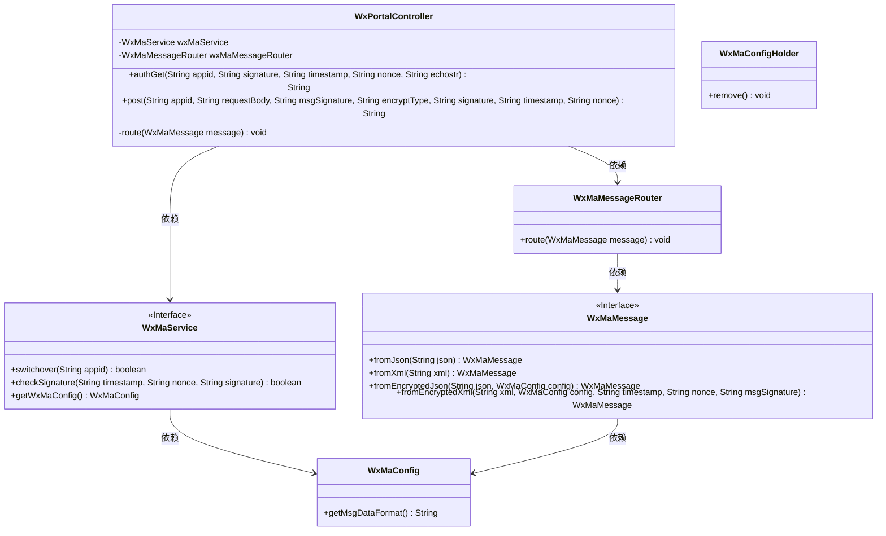
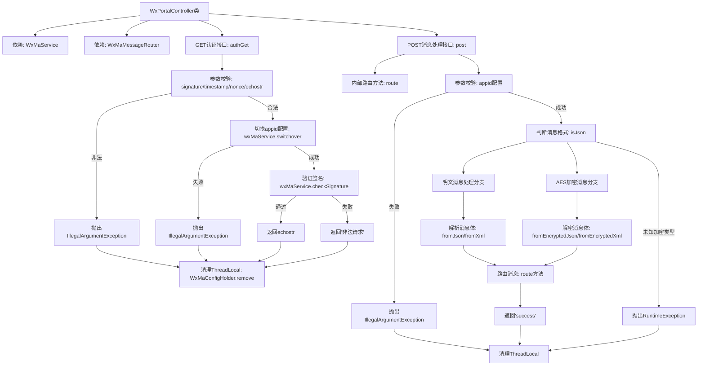

# 基础信息

|      |      |
|------|------|
| 名称 | WxPortalController |
| 编码语言 | .java |
| 代码路径 | weixin-java-miniapp-demo/src/main/java/com/github/binarywang/demo/wx/miniapp/controller/WxPortalController.java |
| 包名 | com.github.binarywang.demo.wx.miniapp.controller |
| 依赖项 | ['cn.binarywang.wx.miniapp.api.WxMaService', 'cn.binarywang.wx.miniapp.bean.WxMaMessage', 'cn.binarywang.wx.miniapp.constant.WxMaConstants', 'cn.binarywang.wx.miniapp.message.WxMaMessageRouter', 'cn.binarywang.wx.miniapp.util.WxMaConfigHolder', 'lombok.AllArgsConstructor', 'lombok.extern.slf4j.Slf4j', 'org.apache.commons.lang3.StringUtils', 'org.springframework.web.bind.annotation', 'java.util.Objects'] |
| 概述说明 | 微信小程序控制器，处理GET/POST请求，验证签名并路由消息，支持明文和AES加密消息，返回成功或错误响应。 |

# 说明

这是一个微信小程序后台控制器类，包含两个主要接口。GET接口用于微信服务器认证验证，接收signature、timestamp、nonce和echostr参数，验证签名后返回echostr。POST接口处理微信消息推送，支持明文和AES加密两种格式，根据配置自动解析JSON或XML格式的消息体，并通过消息路由器处理消息。两个接口都会在最后清理ThreadLocal存储的配置信息。控制器还包含日志记录和异常处理功能。

# 类列表 Class Summary

| 名称   | 类型  | 说明 |
|-------|------|-------------|
| WxPortalController | class | 微信小程序控制器，处理认证和消息请求，验证签名并路由消息，支持明文和AES加密，返回成功或错误信息。 |

## 类 WxPortalController

|      |      |
|------|------|
| 访问范围 | @RestController;@AllArgsConstructor;@RequestMapping("/wx/portal/{appid}");@Slf4j;public |
| 类型 | class |
| 名称 | WxPortalController |
| 说明 | 微信小程序控制器，处理认证和消息请求，验证签名并路由消息，支持明文和AES加密，返回成功或错误信息。 |

### UML类图

类图描述：该图展示了微信门户控制器(WxPortalController)的核心结构，它通过依赖关系与微信服务(WxMaService)、消息路由器(WxMaMessageRouter)交互。控制器包含认证(authGet)和处理(post)两个主要方法，处理微信服务器请求时会检查签名、解析消息格式(JSON/XML)并路由消息。消息处理涉及加密类型判断和线程本地配置清理，体现了完整的微信消息处理流程。

### 内部方法调用关系图

该流程图展示了微信门户控制器的核心处理逻辑，包含GET认证和POST消息处理两个主要接口。GET接口负责验证微信服务器签名，通过三层校验（参数非空检查、appid配置检查、签名验证）后返回响应；POST接口根据加密类型分支处理，支持明文和AES加密两种消息格式，最终通过消息路由器分发处理。两个接口均包含ThreadLocal清理机制，确保线程安全。

### 字段列表 Field List

| 名称  | 类型  | 说明 |
|-------|-------|------|
| wxMaMessageRouter | WxMaMessageRouter | 微信小程序消息路由对象 |
| wxMaService | WxMaService | 微信小程序服务实例，私有不可变。 |

### 方法列表

| 名称  | 类型  | 说明 |
|-------|-------|------|
| route | void | 路由处理微信小程序消息，异常时记录错误日志。 |
| authGet | String | 这是一个处理微信服务器认证请求的GET接口，验证签名参数后返回echostr或错误信息。 |
| post | String | 处理微信请求的POST接口，支持明文和AES加密消息，验证appid后根据消息格式（JSON/XML）解析并路由，最后清理ThreadLocal返回成功或错误。 |

