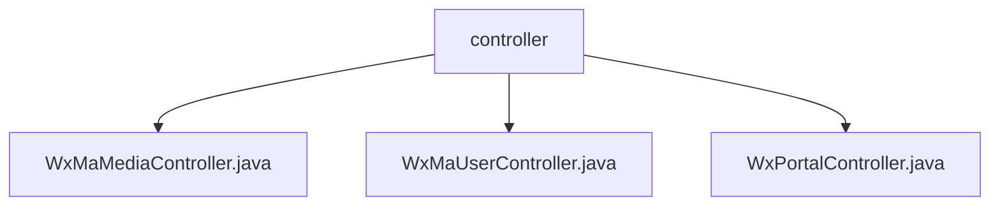

# 基础信息

|      |      |
|------|------|
| 名称 | controller |
| 编码语言 | .java |
| 代码路径 | weixin-java-miniapp-demo/src/main/java/com/github/binarywang/demo/wx/miniapp/controller |
| 包名 | docs.src.main.java.com.github.binarywang.demo.wx.miniapp.controller |
| 概述说明 | 微信小程序三个控制器类：媒体控制器处理文件上传下载；用户控制器管理登录、用户信息和手机号；后台控制器处理微信服务器认证和消息推送。均含配置清理功能。 |

# 说明

## 概述  
该模块是微信小程序后端核心控制器集合，主要负责媒体文件管理、用户会话处理和微信服务器交互。接口规范统一采用HTTP协议，均包含配置验证和ThreadLocal清理机制，类似网关模式处理微信生态各类请求。关键数据结构包括media_id、appid、sessionKey等微信标准参数。外部依赖微信JSSDK、消息加解密库和HTTP组件。例如媒体控制器处理多文件上传，用户控制器实现会话信息解密。

## 主要业务场景  
模块完整支持小程序开发生命周期：服务器验证（类似握手协议）、用户登录授权（OAuth2.0简化流程）、媒体资源托管（类似CDN边缘存储）。典型交互模式为接收微信参数→验证配置→执行业务→返回加密/文件数据。例如门户控制器同时处理GET/POST请求，用户控制器串联code2session与信息解密流程。API类型涵盖RESTful接口和文件传输，集成案例包括消息推送处理、临时素材管理等微信标准场景。

### 包内部结构视图

该流程图展示了微信小程序demo项目中控制器的层级结构。根节点为controller文件夹，包含三个子节点：WxMaMediaController、WxMaUserController和WxPortalController三个控制器类文件。这些文件都位于同一目录层级下，没有更深层次的嵌套关系。

# 文件列表

| 名称   | 类型  | 说明 |
|-------|------|-------------|
| [WxMaMediaController.java](WxMaMediaController.md) | file | 微信小程序素材控制器，提供上传和下载临时素材功能。上传需验证appid并处理多文件，返回media_id列表；下载需验证appid并返回素材文件。 |
| [WxMaUserController.java](WxMaUserController.md) | file | 微信小程序用户控制器，提供登录、用户信息和手机号获取接口，验证appid和用户数据，返回JSON格式结果，每次请求后清理ThreadLocal。 |
| [WxPortalController.java](WxPortalController.md) | file | 微信小程序控制器，处理GET/POST请求，验证签名并路由消息，支持明文和AES加密消息，返回成功或错误响应。 |

