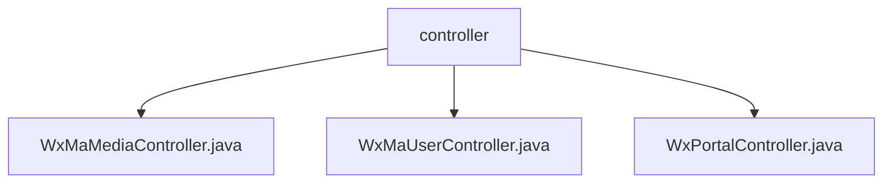

# 基础信息

|      |      |
|------|------|
| 名称 | controller |
| 编码语言 | .java |
| 代码路径 | weixin-java-miniapp-demo/src/main/java/com/github/binarywang/demo/wx/miniapp/controller |
| 包名 | docs.src.main.java.com.github.binarywang.demo.wx.miniapp.controller |
| 概述说明 | 微信小程序Spring Boot Demo包含三个控制器。WxMaMediaController处理媒体文件上传下载。WxMaUserController负责用户登录、获取信息和手机号。WxPortalController用于微信服务器验证和用户消息处理。每个控制器都会在校验配置后执行对应业务并清理线程数据。 |

# 说明

## 概述
这是一个基于Spring Boot构建的微信小程序后端服务模块，提供统一的微信API代理与业务逻辑封装。核心职责是处理来自微信小程序或服务器的请求，包括媒体文件管理、用户身份认证与数据获取，以及服务器消息验证与分发。它充当了业务应用与微信官方服务之间的桥梁。

模块遵循RESTful接口规范，通过一系列控制器暴露HTTP端点。其统一的设计模式是在每个请求处理前，根据传入的小程序标识（appid）动态加载对应配置，并在执行后清理线程本地存储以确保数据隔离。这类似一个配置感知的请求路由层。

关键数据结构包括小程序配置对象、微信服务返回的媒体文件标识（media_id）、用户会话信息（包含openid和session_key）以及加密的用户数据包。这些结构在各控制器间流转，用于校验、解密和业务处理。

外部依赖项主要包括Spring Boot Web框架、微信Java开发工具包（weixin-java-miniapp）用于调用微信服务、以及可能的配置管理服务。例如，所有控制器都依赖`WxMaService`来执行具体的微信API调用。

具体实现案例清晰，例如：`WxMaMediaController`通过`POST /media/upload`接口接收表单文件并上传至微信，返回media_id列表；`WxMaUserController`通过`GET /user/login`接口使用code换取用户会话。

## 主要业务场景
模块的业务流程主要围绕三类交互：文件资源管理、用户身份与数据管理、以及服务器端消息事件处理。这三者共同构成了小程序后端的核心支撑能力，确保了小程序与微信生态的完整对接。

交互模式统一为“配置校验→调用微信服务→处理返回数据→清理环境”。用户登录场景中，前端提交code，后端调用`WxMaService`的`jsCode2SessionInfo`方法获取会话。类似事件总线模式，`WxPortalController`将验证后的用户消息路由到内部处理器。

功能完整性体现在覆盖了小程序开发所需的关键后端接口，包括临时素材上传下载、用户登录与信息获取、以及服务器配置验证与消息处理。这使得开发者可以快速构建具备微信标准能力的小程序服务端。

典型应用模式是：一个小程序前端调用用户登录接口完成认证，之后可调用获取用户信息或手机号接口；同时，开发者可以在管理后台上传宣传素材；微信服务器则通过验证接口与消息接口与后端通信。

API类型均为HTTP接口，集成案例明确。例如，媒体上传接口集成文件接收与微信API调用；消息处理接口集成签名验证、消息解密与内容路由，支持明文和AES加密两种消息格式。

### 包内部结构视图

该流程图展示了一个名为`controller`的文件夹，它是项目的控制器层。该文件夹下直接包含三个Java控制器文件：`WxMaMediaController.java`、`WxMaUserController.java`和`WxPortalController.java`，它们分别用于处理微信小程序中的媒体上传下载、用户信息和请求入口相关业务逻辑。

# 文件列表

| 名称   | 类型  | 说明 |
|-------|------|-------------|
| [WxMaMediaController.java](WxMaMediaController.md) | file | 这是一个微信小程序临时素材管理控制器。包含上传和下载素材两个接口。上传接口处理多文件，返回media_id列表；下载接口根据media_id获取文件。执行前后会进行小程序配置切换和清理。 |
| [WxMaUserController.java](WxMaUserController.md) | file | 这是一个处理微信小程序用户相关请求的控制器。它包含三个主要接口：用户登录、获取用户信息和获取用户手机号。所有接口都依赖于微信服务进行身份验证和数据解密，并在操作前后进行线程本地资源的清理。 |
| [WxPortalController.java](WxPortalController.md) | file | 这是一个处理微信小程序服务器请求的控制器类。它包含两个核心接口：一个用于验证服务器配置的GET请求，另一个用于处理用户消息的POST请求。控制器会根据请求参数和消息格式进行消息路由处理，并确保每次请求后清理线程本地存储。 |

