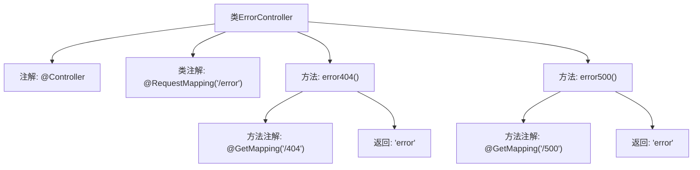

# 基础信息

|      |      |
|------|------|
| 名称 | ErrorController |
| 编码语言 | .java |
| 代码路径 | weixin-java-miniapp-demo/src/main/java/com/github/binarywang/demo/wx/miniapp/error/ErrorController.java |
| 包名 | com.github.binarywang.demo.wx.miniapp.error |
| 依赖项 | ['org.springframework.stereotype.Controller', 'org.springframework.web.bind.annotation.GetMapping', 'org.springframework.web.bind.annotation.RequestMapping'] |
| 概述说明 | ErrorController处理404和500错误，返回统一错误页面。 |

# 说明

这是一个Spring MVC控制器类，专门处理错误页面请求。类名为ErrorController，通过@RequestMapping注解映射到"/error"路径。包含两个GET请求处理方法：error404处理404错误路径"/error/404"，error500处理500错误路径"/error/500"。两个方法都返回名为"error"的视图字符串，表示使用相同的错误页面模板。该类提供了基本的HTTP错误处理功能，但没有包含具体的错误处理逻辑或自定义错误信息。

# 类列表 Class Summary

| 名称   | 类型  | 说明 |
|-------|------|-------------|
| ErrorController | class | ErrorController处理404和500错误，返回统一错误页面。 |


## 类 ErrorController

|      |      |
|------|------|
| 访问范围 | @Controller;@RequestMapping("/error");public |
| 类型 | class |
| 名称 | ErrorController |
| 说明 | ErrorController处理404和500错误，返回统一错误页面。 |


### UML类图

```mermaid
classDiagram
    class ErrorController {
        <<Controller>>
        +error404() String
        +error500() String
    }
    ErrorController --> SpringFramework : 依赖
    note for ErrorController "处理HTTP错误页面的控制器"

    <<Interface>> SpringFramework {
        <<Spring MVC框架接口>>
    }
```

类图描述：
该图展示了一个Spring MVC的ErrorController类，标注了@Controller注解，包含两个处理不同错误码的GET请求方法（404和500）。控制器依赖于Spring框架的基础设施，两个方法都返回相同的错误视图名称"error"。这是一个典型的Spring MVC错误处理控制器结构，用于集中管理Web应用中的错误页面路由。


### 内部方法调用关系图



该流程图展示了Spring MVC中ErrorController类的结构，包含两个处理不同错误路径的方法。类通过@Controller注解标记为控制器，并设置根路径为"/error"。error404()方法处理"/404"路径请求，error500()处理"/500"路径请求，两者均返回"error"视图名称。图中清晰呈现了类与方法的注解关系及返回值流向，符合Spring MVC控制器的典型设计模式。

### 字段列表 Field List

| 名称  | 类型  | 说明 |
|-------|-------|------|

### 方法列表

| 名称  | 类型  | 说明 |
|-------|-------|------|
| error404 | String | 这是一个Spring MVC的GET请求处理方法，路径为"/404"，返回字符串"error"。 |
| error500 | String | Spring MVC接口，GET请求路径为/500，返回字符串error。 |


