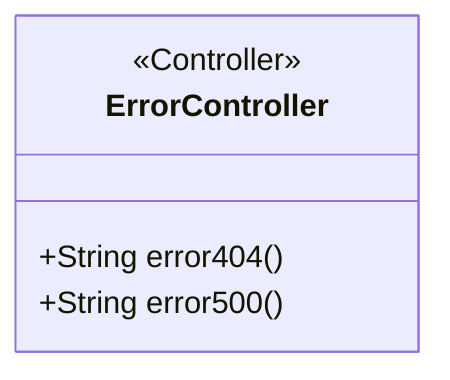
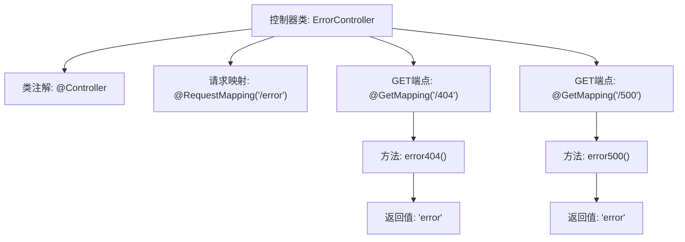

# 基础信息

|      |      |
|------|------|
| 名称 | ErrorController |
| 编码语言 | .java |
| 代码路径 | weixin-java-miniapp-demo/src/main/java/com/github/binarywang/demo/wx/miniapp/error/ErrorController.java |
| 包名 | com.github.binarywang.demo.wx.miniapp.error |
| 依赖项 | ['org.springframework.stereotype.Controller', 'org.springframework.web.bind.annotation.GetMapping', 'org.springframework.web.bind.annotation.RequestMapping'] |
| 概述说明 | 该控制器处理404和500错误，通过@GetMapping映射到对应路径并返回error视图。 |

# 说明

这是一个Java Spring MVC框架的控制器类，名为ErrorController。它被映射到Web应用程序的“/error”路径。该类包含两个公开的处理方法。第一个方法error404通过@GetMapping注解处理对“/error/404”路径的HTTP GET请求。第二个方法error500通过@GetMapping注解处理对“/error/500”路径的HTTP GET请求。这两个方法的功能是相同的，它们都会返回一个名为“error”的字符串，这通常指向一个用于显示错误信息给用户的视图页面，例如HTML页面。这个控制器专门用于处理应用程序中特定的HTTP错误状态码，即404（未找到）和500（内部服务器错误）。

# 类列表 Class Summary

| 名称   | 类型  | 说明 |
|-------|------|-------------|
| ErrorController | class | 错误处理控制器，定义了处理404和500错误的端点，统一返回error视图。 |

## 类 ErrorController

|      |      |
|------|------|
| 访问范围 | @Controller;@RequestMapping("/error");public |
| 类型 | class |
| 名称 | ErrorController |
| 说明 | 错误处理控制器，定义了处理404和500错误的端点，统一返回error视图。 |

### UML类图

该类图展示了ErrorController的结构，它是一个Spring MVC控制器类。该类包含两个公共方法：error404()和error500()，分别处理404和500错误页面的请求。这两个方法都返回字符串"error"，对应于视图模板的名称。该类使用@Controller注解标识为控制器，并通过@RequestMapping注解映射到"/error"路径。整体设计简洁，专注于错误页面的路由处理。

### 内部方法调用关系图

这段代码定义了一个Spring MVC错误处理控制器，包含两个GET端点分别处理404和500错误。当用户访问"/error/404"或"/error/500"路径时，控制器会分别调用error404()和error500()方法，两个方法都返回"error"视图名称用于显示统一的错误页面。代码结构简洁，通过注解配置路由映射，体现了Spring框架的声明式编程特性。

### 字段列表 Field List

| 名称  | 类型  | 说明 |
|-------|-------|------|

### 方法列表

| 名称  | 类型  | 说明 |
|-------|-------|------|
| error404 | String | 定义GET请求路径404，返回错误页面字符串。 |
| error500 | String | 这是一个Spring MVC控制器方法。它映射到GET请求的"/500"路径，当访问该路径时，会返回一个名为"error"的视图。此方法通常用于处理服务器内部错误（500错误）页面。 |

