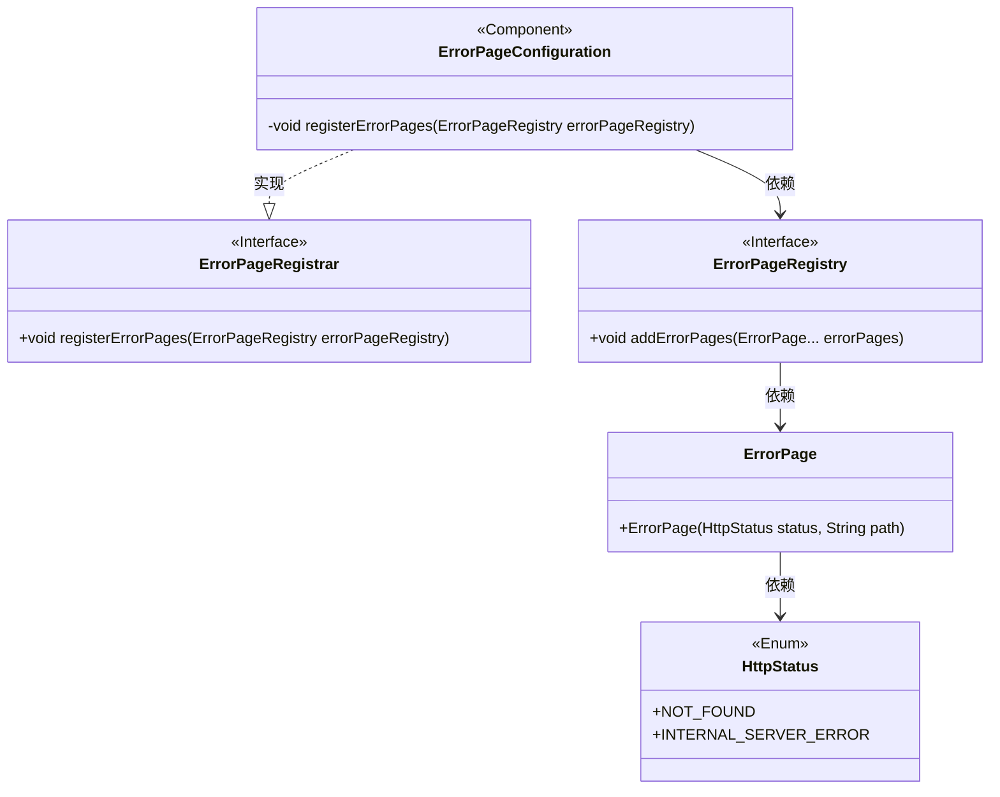
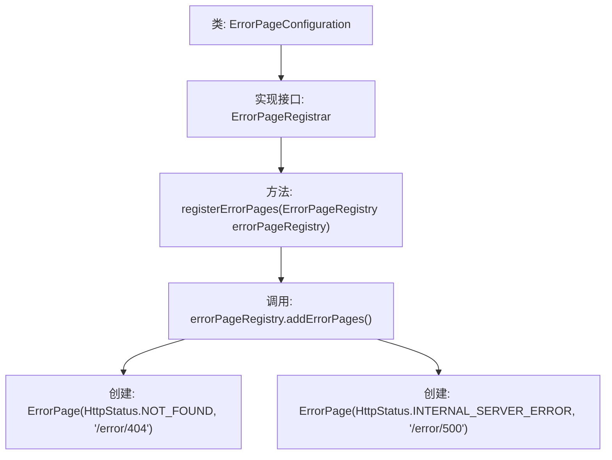

# 基础信息

|      |      |
|------|------|
| 名称 | ErrorPageConfiguration |
| 编码语言 | .java |
| 代码路径 | weixin-java-miniapp-demo/src/main/java/com/github/binarywang/demo/wx/miniapp/error/ErrorPageConfiguration.java |
| 包名 | com.github.binarywang.demo.wx.miniapp.error |
| 依赖项 | ['org.springframework.boot.web.server.ErrorPage', 'org.springframework.boot.web.server.ErrorPageRegistrar', 'org.springframework.boot.web.server.ErrorPageRegistry', 'org.springframework.http.HttpStatus', 'org.springframework.stereotype.Component'] |
| 概述说明 | 该组件注册了自定义错误页面，当遇到404或500错误时，会分别重定向到指定路径处理。 |

# 说明

该代码片段定义了一个Spring框架组件类，用于配置自定义错误页面。这个名为ErrorPageConfiguration的类实现了ErrorPageRegistrar接口。在其核心方法中，它向错误页面注册表添加了两个特定HTTP状态码与对应处理路径的映射关系。具体配置是当应用程序遇到404状态码（资源未找到）时，会将请求导向“/error/404”路径；当遇到500状态码（服务器内部错误）时，则将请求导向“/error/500”路径。这实现了对两种常见HTTP错误的集中式自定义处理。

# 类列表 Class Summary

| 名称   | 类型  | 说明 |
|-------|------|-------------|
| ErrorPageConfiguration | class | Spring Boot组件注册404和500错误页，分别映射到/error/404和/error/500路径。 |

## 类 ErrorPageConfiguration

|      |      |
|------|------|
| 访问范围 | @Component;public |
| 类型 | class |
| 名称 | ErrorPageConfiguration |
| 说明 | Spring Boot组件注册404和500错误页，分别映射到/error/404和/error/500路径。 |

### UML类图

这段代码是一个Spring Boot错误页面配置类，它实现了ErrorPageRegistrar接口来注册自定义错误页面。当应用发生404或500错误时，会分别重定向到"/error/404"和"/error/500"路径。ErrorPageConfiguration类通过@Component注解成为Spring管理的Bean，并在启动时自动执行错误页面注册逻辑，确保统一的错误处理机制。

### 内部方法调用关系图

这段流程图展示了ErrorPageConfiguration类的结构和工作流程。该类实现了ErrorPageRegistrar接口，核心方法是registerErrorPages。在该方法中，通过传入的ErrorPageRegistry对象调用addErrorPages方法，注册了两个错误页面：404错误指向"/error/404"，500错误指向"/error/500"。整个流程清晰地展示了从类定义到错误页面注册的完整调用链。

### 字段列表 Field List

| 名称  | 类型  | 说明 |
|-------|-------|------|

### 方法列表

| 名称  | 类型  | 说明 |
|-------|-------|------|
| registerErrorPages | void | 注册自定义错误页面，包括404未找到和500内部服务器错误，分别指向/error/404和/error/500路径。 |

