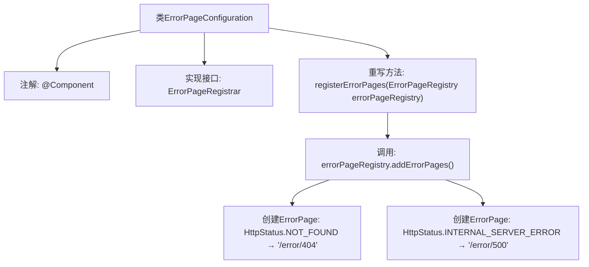

# 基础信息

|      |      |
|------|------|
| 名称 | ErrorPageConfiguration |
| 编码语言 | .java |
| 代码路径 | weixin-java-miniapp-demo/src/main/java/com/github/binarywang/demo/wx/miniapp/error/ErrorPageConfiguration.java |
| 包名 | com.github.binarywang.demo.wx.miniapp.error |
| 依赖项 | ['org.springframework.boot.web.server.ErrorPage', 'org.springframework.boot.web.server.ErrorPageRegistrar', 'org.springframework.boot.web.server.ErrorPageRegistry', 'org.springframework.http.HttpStatus', 'org.springframework.stereotype.Component'] |
| 概述说明 | ErrorPageConfiguration类实现ErrorPageRegistrar接口，注册404和500错误页，分别映射到/error/404和/error/500路径。 |

# 说明

这是一个Spring组件类，用于配置自定义错误页面。该类实现了ErrorPageRegistrar接口，通过重写registerErrorPages方法注册了两个错误页面：当出现404状态码时跳转到/error/404路径，出现500状态码时跳转到/error/500路径。该配置通过ErrorPageRegistry对象添加错误页面映射关系。

# 类列表 Class Summary

| 名称   | 类型  | 说明 |
|-------|------|-------------|
| ErrorPageConfiguration | class | ErrorPageConfiguration类注册404和500错误页，分别映射到/error/404和/error/500路径。 |


## 类 ErrorPageConfiguration

|      |      |
|------|------|
| 访问范围 | @Component;public |
| 类型 | class |
| 名称 | ErrorPageConfiguration |
| 说明 | ErrorPageConfiguration类注册404和500错误页，分别映射到/error/404和/error/500路径。 |


### UML类图

```mermaid
classDiagram
    class ErrorPageConfiguration {
        +registerErrorPages(ErrorPageRegistry errorPageRegistry) void
    }
    <<Interface>> ErrorPageRegistrar {
        +registerErrorPages(ErrorPageRegistry errorPageRegistry) void
    }
    class ErrorPageRegistry {
        +addErrorPages(ErrorPage... errorPages) void
    }
    class ErrorPage {
        +ErrorPage(HttpStatus status, String path)
    }
    class HttpStatus {
        <<enumeration>>
        NOT_FOUND
        INTERNAL_SERVER_ERROR
        // other status codes...
    }

    ErrorPageConfiguration --> ErrorPageRegistrar : 实现
    ErrorPageConfiguration --> ErrorPageRegistry : 依赖
    ErrorPageConfiguration --> ErrorPage : 创建
    ErrorPage --> HttpStatus : 使用
```

类图描述：该图展示了Spring Boot错误页面配置的核心结构。ErrorPageConfiguration类实现了ErrorPageRegistrar接口，通过依赖ErrorPageRegistry来注册错误页面。它创建包含HTTP状态码和路径的ErrorPage对象，其中HttpStatus是一个枚举类。这种设计实现了将特定HTTP错误状态映射到自定义错误页面的功能。


### 内部方法调用关系图



这段代码是Spring框架中用于自定义错误页面的配置类。通过实现`ErrorPageRegistrar`接口并重写`registerErrorPages`方法，将HTTP状态码404和500分别映射到`/error/404`和`/error/500`路径。当应用出现对应错误时，会自动跳转到指定路径处理错误响应。流程图展示了从类声明到具体错误页面注册的完整调用链，体现了Spring Boot的错误处理机制。

### 字段列表 Field List

| 名称  | 类型  | 说明 |
|-------|-------|------|

### 方法列表

| 名称  | 类型  | 说明 |
|-------|-------|------|
| registerErrorPages | void | 该方法注册了两个错误页面：404错误跳转至"/error/404"，500错误跳转至"/error/500"。 |


