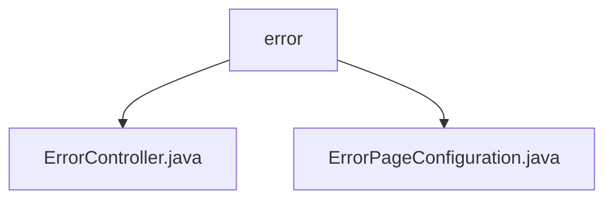

# 基础信息

|      |      |
|------|------|
| 名称 | error |
| 编码语言 | .java |
| 代码路径 | weixin-java-miniapp-demo/src/main/java/com/github/binarywang/demo/wx/miniapp/error |
| 包名 | docs.src.main.java.com.github.binarywang.demo.wx.miniapp.error |
| 概述说明 | ErrorController类处理/error路径下的404和500错误，返回统一错误页面。ErrorPageConfiguration类实现错误页面配置，将404和500状态码映射到对应路径。 |

# 说明

## 概述  
该模块核心职责是统一处理HTTP错误响应，通过控制器和配置类实现404/500错误的页面跳转。接口规范包含两个GET端点：/error/404和/error/500，均返回"error"视图模板。关键数据结构为Spring的ErrorPageRegistry，用于注册错误路径映射。外部依赖仅Spring MVC框架。例如ErrorController处理路径映射，ErrorPageConfiguration实现错误跳转配置。

## 主要业务场景  
模块采用前后端协作模式，类似网关错误拦截机制。当系统出现404/500错误时，自动路由到预设路径并渲染统一错误页。功能完整性体现在错误捕获与视图返回的闭环处理，例如404资源缺失触发/error/404跳转。典型应用场景包括API请求异常或静态资源丢失，通过标准化错误页提升用户体验。

### 包内部结构视图

该流程图展示了微信小程序demo项目中错误处理模块的层级结构。根节点为error目录，包含两个子文件：ErrorController.java处理错误请求，ErrorPageConfiguration.java配置错误页面。结构简洁明了，体现了错误处理模块的基本组成。

# 文件列表

| 名称   | 类型  | 说明 |
|-------|------|-------------|
| [ErrorController.java](ErrorController.md) | file | ErrorController处理404和500错误，返回统一错误页面。 |
| [ErrorPageConfiguration.java](ErrorPageConfiguration.md) | file | ErrorPageConfiguration类实现ErrorPageRegistrar接口，注册404和500错误页，分别映射到/error/404和/error/500路径。 |

