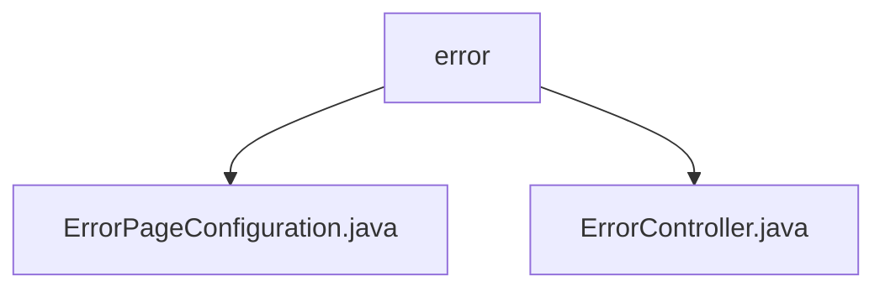

# 基础信息

|      |      |
|------|------|
| 名称 | error |
| 编码语言 | .java |
| 代码路径 | weixin-java-miniapp-demo/src/main/java/com/github/binarywang/demo/wx/miniapp/error |
| 包名 | docs.src.main.java.com.github.binarywang.demo.wx.miniapp.error |
| 概述说明 | 代码定义了两个Spring组件。ErrorPageConfiguration配置404和500错误指向自定义路径。ErrorController提供处理这些错误路径的端点并返回错误视图。实现自定义HTTP错误处理。 |

# 说明

## 概述
该模块负责为Web应用提供自定义HTTP错误页面处理机制，核心职责是集中配置并响应特定HTTP错误状态码。接口规范通过实现Spring的`ErrorPageRegistrar`来注册错误路径映射，并提供一个`ErrorController`来处理映射后的请求。关键数据结构包括Spring MVC的`ErrorPage`和用于注册的`ErrorPageRegistry`。外部依赖项主要为Spring Framework。

例如，`ErrorPageConfiguration`将404和500状态码分别映射到`/error/404`和`/error/500`路径。

## 主要业务场景
模块实现了从错误捕获到错误页面展示的完整流程。当应用抛出404或500错误时，流程类似事件总线模式，请求被自动导向配置的路径，并由`ErrorController`中的对应方法处理。这提供了统一的错误交互模式。

其功能完整覆盖了两种常见错误的定制化处理。典型应用模式是集成到Spring Boot Web应用中，以替换默认错误页面。API类型为Spring配置类与REST控制器，集成案例即上述错误页面配置与响应控制器。

### 包内部结构视图

该流程图展示了`error`目录下的两个Java文件：`ErrorPageConfiguration.java`和`ErrorController.java`。这两个文件都直接位于`error`目录中，构成了一个简单的两层结构，反映了项目错误处理模块的基本代码组织方式，`error`作为父节点，两个控制器文件作为其子节点。

# 文件列表

| 名称   | 类型  | 说明 |
|-------|------|-------------|
| [ErrorPageConfiguration.java](ErrorPageConfiguration.md) | file | 该组件注册了自定义错误页面，当遇到404或500错误时，会分别重定向到指定路径处理。 |
| [ErrorController.java](ErrorController.md) | file | 该控制器处理404和500错误，通过@GetMapping映射到对应路径并返回error视图。 |

