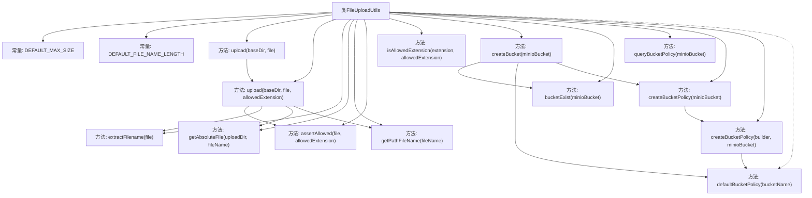

# 基础信息

|      |      |
|------|------|
| 名称 | FileUploadUtils |
| 编码语言 | .java |
| 代码路径 | weixin-java-miniapp-demo/src/main/java/com/github/binarywang/demo/wx/miniapp/utils/FileUploadUtils.java |
| 包名 | com.leaniss.file.utils |
| 依赖项 | ['java.io.File', 'java.io.IOException', 'java.nio.file.Paths', 'java.security.InvalidKeyException', 'java.security.NoSuchAlgorithmException', 'java.util.Objects', 'com.leaniss.file.bean.MinioBucket', 'io.minio.BucketExistsArgs', 'io.minio.GetBucketPolicyArgs', 'io.minio.MakeBucketArgs', 'io.minio.SetBucketPolicyArgs', 'io.minio.errors', 'lombok.SneakyThrows', 'org.apache.commons.io.FilenameUtils', 'org.springframework.web.multipart.MultipartFile', 'com.leaniss.common.core.exception.file.FileException', 'com.leaniss.common.core.exception.file.FileNameLengthLimitExceededException', 'com.leaniss.common.core.exception.file.FileSizeLimitExceededException', 'com.leaniss.common.core.exception.file.InvalidExtensionException', 'com.leaniss.common.core.utils.DateUtils', 'com.leaniss.common.core.utils.StringUtils', 'com.leaniss.common.core.utils.file.FileTypeUtils', 'com.leaniss.common.core.utils.file.MimeTypeUtils', 'com.leaniss.common.core.utils.uuid.Seq'] |
| 概述说明 | FileUploadUtils类提供文件上传功能，支持大小和类型校验，默认限制50M和文件名长度100，同时包含MinIO桶管理方法如创建桶、检查存在和设置策略。 |

# 说明

FileUploadUtils是一个文件上传工具类，提供文件上传、大小校验、文件名处理等功能。默认文件大小限制为50M，文件名长度限制为100字符。支持根据文件路径上传，校验文件类型和大小，处理文件名编码。同时包含MinIO桶管理功能，如创建桶、检查桶存在、设置和查询桶策略。桶策略默认允许公共读取和写入操作。

# 类列表 Class Summary

| 名称   | 类型  | 说明 |
|-------|------|-------------|
| FileUploadUtils | class | FileUploadUtils类提供文件上传功能，支持大小校验、文件名长度限制、类型校验，默认大小50M，文件名长度100。同时包含MinIO桶管理方法，如创建桶、检查存在、设置策略等。 |

## 类 FileUploadUtils

|      |      |
|------|------|
| 访问范围 | public |
| 类型 | class |
| 名称 | FileUploadUtils |
| 说明 | FileUploadUtils类提供文件上传功能，支持大小校验、文件名长度限制、类型校验，默认大小50M，文件名长度100。同时包含MinIO桶管理方法，如创建桶、检查存在、设置策略等。 |

### UML类图

```mermaid
classDiagram
    class FileUploadUtils {
        +long DEFAULT_MAX_SIZE
        +int DEFAULT_FILE_NAME_LENGTH
        +String upload(String baseDir, MultipartFile file) throws IOException
        +String upload(String baseDir, MultipartFile file, String[] allowedExtension) throws FileSizeLimitExceededException, IOException, FileNameLengthLimitExceededException, InvalidExtensionException
        +String extractFilename(MultipartFile file)
        -File getAbsoluteFile(String uploadDir, String fileName) throws IOException
        -String getPathFileName(String fileName) throws IOException
        +void assertAllowed(MultipartFile file, String[] allowedExtension) throws FileSizeLimitExceededException, InvalidExtensionException
        +boolean isAllowedExtension(String extension, String[] allowedExtension)
        +void createBucket(MinioBucket minioBucket) throws IOException, InvalidKeyException, InvalidResponseException, InsufficientDataException, NoSuchAlgorithmException, ServerException, InternalException, XmlParserException, ErrorResponseException
        +boolean bucketExist(MinioBucket minioBucket) throws IOException, InvalidKeyException, InvalidResponseException, InsufficientDataException, NoSuchAlgorithmException, ServerException, InternalException, XmlParserException, ErrorResponseException
        +StringBuilder queryBucketPolicy(MinioBucket minioBucket)
        +void createBucketPolicy(MinioBucket minioBucket)
        +void createBucketPolicy(StringBuilder builder, MinioBucket minioBucket)
        -StringBuilder defaultBucketPolicy(String bucketName)
    }

    class MultipartFile {
        <<Interface>>
        +String getOriginalFilename()
        +long getSize()
        +void transferTo(Path dest) throws IOException, IllegalStateException
    }

    class FileException {
        +String getDefaultMessage()
    }

    class FileSizeLimitExceededException {
        +FileSizeLimitExceededException(long maxSize)
    }

    class FileNameLengthLimitExceededException {
        +FileNameLengthLimitExceededException(int maxLength)
    }

    class InvalidExtensionException {
        <<Interface>>
        +InvalidImageExtensionException(String[] allowedExtension, String extension, String fileName)
        +InvalidFlashExtensionException(String[] allowedExtension, String extension, String fileName)
        +InvalidMediaExtensionException(String[] allowedExtension, String extension, String fileName)
        +InvalidVideoExtensionException(String[] allowedExtension, String extension, String fileName)
    }

    class MinioBucket {
        +String getBucketName()
        +String getRegion()
        +MinioClient getMinioClient()
    }

    FileUploadUtils --> MultipartFile : 使用
    FileUploadUtils --> FileException : 抛出
    FileUploadUtils --> FileSizeLimitExceededException : 抛出
    FileUploadUtils --> FileNameLengthLimitExceededException : 抛出
    FileUploadUtils --> InvalidExtensionException : 抛出
    FileUploadUtils --> MinioBucket : 使用
```

类图描述：FileUploadUtils是一个文件上传工具类，提供了文件上传、文件名编码、文件大小校验、文件类型校验等功能。它依赖于MultipartFile接口来处理上传的文件，并可能抛出FileException、FileSizeLimitExceededException、FileNameLengthLimitExceededException和InvalidExtensionException等异常。此外，它还提供了与MinIO存储桶相关的操作，如创建桶、检查桶是否存在、查询和设置桶策略等。

### 内部方法调用关系图

这段代码是文件上传工具类，包含文件大小校验、文件名处理、路径生成等核心功能，同时集成了MinIO存储桶的创建和管理逻辑。主要流程包括：校验文件名长度和文件类型、生成唯一文件名、保存文件到指定路径，以及MinIO桶的创建策略配置。异常处理覆盖文件过大、文件名过长、类型不匹配等场景，确保上传过程安全可靠。

### 字段列表 Field List

| 名称  | 类型  | 说明 |
|-------|-------|------|
| DEFAULT_FILE_NAME_LENGTH = 100 | int | 定义常量DEFAULT_FILE_NAME_LENGTH，默认文件名长度限制为100字符。 |
| DEFAULT_MAX_SIZE = 50 * 1024 * 1024 | long | 定义默认最大大小为50MB的静态常量。 |

### 方法列表

| 名称  | 类型  | 说明 |
|-------|-------|------|
| isAllowedExtension | boolean | 检查文件扩展名是否在允许的列表中，忽略大小写。存在则返回true，否则返回false。 |
| createBucket | void | 创建MinIO存储桶的方法，检查桶是否存在，不存在则根据配置创建并设置默认策略。处理多种异常情况。 |
| getPathFileName | String | 该方法接收文件名参数，返回以斜杠开头的路径字符串。无复杂逻辑，仅简单拼接路径格式。 |
| bucketExist | boolean | 检查Minio存储桶是否存在，返回布尔值，可能抛出多种异常。 |
| assertAllowed | void | 检查文件大小和扩展名是否合规，超限或非法扩展名时抛出对应异常。 |
| extractFilename | String | 提取文件名方法：根据日期路径、原文件基础名、序列ID和扩展名生成唯一文件名。 |
| queryBucketPolicy | StringBuilder | 使用SneakyThrows注解处理异常，通过MinioClient查询指定桶的策略并返回StringBuilder结果。 |
| createBucketPolicy | void | 使用@SneakyThrows注解创建Minio存储桶策略，调用重载方法处理。 |
| createBucketPolicy | void | 方法`createBucketPolicy`用于设置MinIO存储桶策略。若输入策略为空，使用默认策略，然后通过MinIO客户端设置策略。 |
| getAbsoluteFile | File | 该方法根据上传目录和文件名创建绝对路径文件对象，若目录不存在则创建，最后返回绝对路径文件对象。 |
| upload | String | 静态方法upload接收目录和文件参数，调用重载方法上传文件，处理异常并抛出IOException。 |
| upload | String | 上传文件方法，检查文件名长度和扩展名，保存文件并返回路径。异常包括文件过大、文件名过长和无效扩展名。 |
| defaultBucketPolicy | StringBuilder | 生成默认S3存储桶策略，允许公开访问特定操作如获取位置、列出分段上传、上传/删除对象等，资源指向指定存储桶及其内容。 |

