# 基础信息

|      |      |
|------|------|
| 名称 | FileUploadUtils |
| 编码语言 | .java |
| 代码路径 | weixin-java-miniapp-demo/src/main/java/com/github/binarywang/demo/wx/miniapp/utils/FileUploadUtils.java |
| 包名 | com.leaniss.file.utils |
| 依赖项 | ['java.io.File', 'java.io.IOException', 'java.nio.file.Paths', 'java.security.InvalidKeyException', 'java.security.NoSuchAlgorithmException', 'java.util.Objects', 'com.leaniss.file.bean.MinioBucket', 'io.minio.BucketExistsArgs', 'io.minio.GetBucketPolicyArgs', 'io.minio.MakeBucketArgs', 'io.minio.SetBucketPolicyArgs', 'io.minio.errors', 'lombok.SneakyThrows', 'org.apache.commons.io.FilenameUtils', 'org.springframework.web.multipart.MultipartFile', 'com.leaniss.common.core.exception.file.FileException', 'com.leaniss.common.core.exception.file.FileNameLengthLimitExceededException', 'com.leaniss.common.core.exception.file.FileSizeLimitExceededException', 'com.leaniss.common.core.exception.file.InvalidExtensionException', 'com.leaniss.common.core.utils.DateUtils', 'com.leaniss.common.core.utils.StringUtils', 'com.leaniss.common.core.utils.file.FileTypeUtils', 'com.leaniss.common.core.utils.file.MimeTypeUtils', 'com.leaniss.common.core.utils.uuid.Seq'] |
| 概述说明 | FileUploadUtils类提供文件上传功能，包含默认配置如文件大小限制50MB和文件名长度限制100字符。支持上传到指定目录并验证文件类型，若超出限制则抛出异常。同时包含MinIO桶管理功能，可检查、创建和配置桶策略。 |

# 说明

这是一个Java文件上传工具类。它定义了默认最大文件大小为50MB和默认文件名最大长度为100个字符。核心功能包括通过指定基础目录和文件进行上传，并可选择允许的文件扩展名类型。上传流程包含文件名长度校验、文件大小和扩展名校验，然后生成一个包含日期路径和序列号的新文件名并保存到指定位置。此外，它还包含一组与MinIO对象存储服务交互的方法，用于创建存储桶、检查桶是否存在以及设置桶的访问策略。其中创建桶时会先检查是否已存在，然后设置一个允许公开获取对象、上传和删除等操作的默认策略。

# 类列表 Class Summary

| 名称   | 类型  | 说明 |
|-------|------|-------------|
| FileUploadUtils | class | FileUploadUtils 类提供文件上传和MinIO桶管理功能，支持文件大小、类型和名称长度验证，以及创建和配置存储桶策略。 |

## 类 FileUploadUtils

|      |      |
|------|------|
| 访问范围 | public |
| 类型 | class |
| 名称 | FileUploadUtils |
| 说明 | FileUploadUtils 类提供文件上传和MinIO桶管理功能，支持文件大小、类型和名称长度验证，以及创建和配置存储桶策略。 |

### UML类图

```mermaid
classDiagram
    class FileUploadUtils {
        +long DEFAULT_MAX_SIZE
        +int DEFAULT_FILE_NAME_LENGTH
        +String upload(String baseDir, MultipartFile file) IOException
        +String upload(String baseDir, MultipartFile file, String[] allowedExtension) FileSizeLimitExceededException, IOException, FileNameLengthLimitExceededException, InvalidExtensionException
        +String extractFilename(MultipartFile file)
        -File getAbsoluteFile(String uploadDir, String fileName) IOException
        -String getPathFileName(String fileName) IOException
        +void assertAllowed(MultipartFile file, String[] allowedExtension) FileSizeLimitExceededException, InvalidExtensionException
        +boolean isAllowedExtension(String extension, String[] allowedExtension)
        +void createBucket(MinioBucket minioBucket) IOException, InvalidKeyException, InvalidResponseException, InsufficientDataException, NoSuchAlgorithmException, ServerException, InternalException, XmlParserException, ErrorResponseException
        +boolean bucketExist(MinioBucket minioBucket) IOException, InvalidKeyException, InvalidResponseException, InsufficientDataException, NoSuchAlgorithmException, ServerException, InternalException, XmlParserException, ErrorResponseException
        +StringBuilder queryBucketPolicy(MinioBucket minioBucket)
        +void createBucketPolicy(MinioBucket minioBucket)
        +void createBucketPolicy(StringBuilder builder, MinioBucket minioBucket)
        -StringBuilder defaultBucketPolicy(String bucketName)
    }
    
    class MultipartFile {
        <<Interface>>
        +String getOriginalFilename()
        +long getSize()
        +void transferTo(Path dest) IOException, IllegalStateException
    }
    
    class FileSizeLimitExceededException {
        +FileSizeLimitExceededException(long maxSize)
    }
    
    class FileNameLengthLimitExceededException {
        +FileNameLengthLimitExceededException(int maxLength)
    }
    
    class InvalidExtensionException {
        <<Interface>>
    }
    
    class InvalidImageExtensionException {
        +InvalidImageExtensionException(String[] allowedExtension, String extension, String fileName)
    }
    
    class InvalidFlashExtensionException {
        +InvalidFlashExtensionException(String[] allowedExtension, String extension, String fileName)
    }
    
    class InvalidMediaExtensionException {
        +InvalidMediaExtensionException(String[] allowedExtension, String extension, String fileName)
    }
    
    class InvalidVideoExtensionException {
        +InvalidVideoExtensionException(String[] allowedExtension, String extension, String fileName)
    }
    
    class MinioBucket {
        +String getBucketName()
        +String getRegion()
        +MinioClient getMinioClient()
    }
    
    class MinioClient {
        +void makeBucket(MakeBucketArgs args) IOException, InvalidKeyException, InvalidResponseException, InsufficientDataException, NoSuchAlgorithmException, ServerException, InternalException, XmlParserException, ErrorResponseException
        +boolean bucketExists(BucketExistsArgs args) IOException, InvalidKeyException, InvalidResponseException, InsufficientDataException, NoSuchAlgorithmException, ServerException, InternalException, XmlParserException, ErrorResponseException
        +String getBucketPolicy(GetBucketPolicyArgs args) IOException, InvalidKeyException, InvalidResponseException, InsufficientDataException, NoSuchAlgorithmException, ServerException, InternalException, XmlParserException, ErrorResponseException
        +void setBucketPolicy(SetBucketPolicyArgs args) IOException, InvalidKeyException, InvalidResponseException, InsufficientDataException, NoSuchAlgorithmException, ServerException, InternalException, XmlParserException, ErrorResponseException
    }
    
    class FileException {
        +String getDefaultMessage()
    }
    
    class File {
        +File(String pathname)
        +boolean exists()
        +File getParentFile()
        +boolean mkdirs()
        +boolean isAbsolute()
        +File getAbsoluteFile()
    }
    
    class MimeTypeUtils {
        +String[] DEFAULT_ALLOWED_EXTENSION
        +String[] IMAGE_EXTENSION
        +String[] FLASH_EXTENSION
        +String[] MEDIA_EXTENSION
        +String[] VIDEO_EXTENSION
    }
    
    class DateUtils {
        +String datePath()
    }
    
    class FilenameUtils {
        +String getBaseName(String filename)
    }
    
    class FileTypeUtils {
        +String getExtension(MultipartFile file)
    }
    
    class Seq {
        +String getId(String seqType)
        +String uploadSeqType
    }
    
    FileUploadUtils ..> MultipartFile : 依赖
    FileUploadUtils ..> FileSizeLimitExceededException : 依赖
    FileUploadUtils ..> FileNameLengthLimitExceededException : 依赖
    FileUploadUtils ..> InvalidExtensionException : 依赖
    FileUploadUtils ..> MinioBucket : 依赖
    FileUploadUtils ..> FileException : 依赖
    FileUploadUtils ..> File : 依赖
    FileUploadUtils ..> MimeTypeUtils : 依赖
    FileUploadUtils ..> DateUtils : 依赖
    FileUploadUtils ..> FilenameUtils : 依赖
    FileUploadUtils ..> FileTypeUtils : 依赖
    FileUploadUtils ..> Seq : 依赖
    
    InvalidExtensionException <|.. InvalidImageExtensionException
    InvalidExtensionException <|.. InvalidFlashExtensionException
    InvalidExtensionException <|.. InvalidMediaExtensionException
    InvalidExtensionException <|.. InvalidVideoExtensionException
```

这段代码定义了一个文件上传工具类 `FileUploadUtils`，主要功能包括文件上传到本地磁盘和MinIO对象存储管理。它首先检查文件名长度、文件大小和扩展名合法性，然后生成唯一文件名并保存到指定目录。对于MinIO操作，提供了桶的创建、存在性检查和策略设置功能。工具类依赖于多个辅助工具类来处理日期路径、文件扩展名、序列号生成等，同时能抛出多种自定义异常来处理不同的错误情况。

### 内部方法调用关系图

```mermaid
graph TD
    A["类FileUploadUtils"]
    B["常量: long DEFAULT_MAX_SIZE"]
    C["常量: int DEFAULT_FILE_NAME_LENGTH"]
    D["方法: upload(baseDir, file)"]
    E["方法: upload(baseDir, file, allowedExtension)"]
    F["方法: extractFilename(file)"]
    G["方法: getAbsoluteFile(uploadDir, fileName)"]
    H["方法: getPathFileName(fileName)"]
    I["方法: assertAllowed(file, allowedExtension)"]
    J["方法: isAllowedExtension(extension, allowedExtension)"]
    K["方法: createBucket(minioBucket)"]
    L["方法: bucketExist(minioBucket)"]
    M["方法: queryBucketPolicy(minioBucket)"]
    N["方法: createBucketPolicy(minioBucket)"]
    O["方法: createBucketPolicy(builder, minioBucket)"]
    P["私有方法: defaultBucketPolicy(bucketName)"]

    A --> B
    A --> C
    A --> D
    A --> E
    A --> F
    A --> G
    A --> H
    A --> I
    A --> J
    A --> K
    A --> L
    A --> M
    A --> N
    A --> O
    A -.-> P
```

**流程图描述：**
该流程图展示了FileUploadUtils类的结构和主要方法。类包含两个常量用于定义文件大小和文件名长度限制，以及多个静态方法用于文件上传和处理。主要方法包括文件上传流程upload、文件名提取extractFilename、文件验证assertAllowed，以及与MinIO存储相关的桶操作如createBucket、bucketExist等。这些方法协同工作，确保文件上传的安全性、合法性，并支持与对象存储服务的集成。

### 字段列表 Field List

| 名称  | 类型  | 说明 |
|-------|-------|------|
| DEFAULT_MAX_SIZE = 50 * 1024 * 1024 | long | 该代码定义了一个公共静态常量DEFAULT_MAX_SIZE，其默认值为50 MB。 |
| DEFAULT_FILE_NAME_LENGTH = 100 | int | 定义常量DEFAULT_FILE_NAME_LENGTH，值为100，指定默认文件名最大长度。 |

### 方法列表

| 名称  | 类型  | 说明 |
|-------|-------|------|
| isAllowedExtension | boolean | 静态方法检查文件扩展名是否在允许列表中。遍历数组，忽略大小写比较，存在则返回真，否则为假。 |
| getAbsoluteFile | File | 该方法用于根据上传目录和文件名获取绝对路径文件对象，如果父目录不存在则创建，最终返回文件的绝对路径对象。 |
| defaultBucketPolicy | StringBuilder | 此Java方法用于生成一个AWS S3存储桶的默认策略JSON字符串。该策略允许所有AWS主体对指定桶执行特定操作，包括获取桶位置、列出多部分上传，以及对桶内对象进行上传、删除和读取等操作。 |
| createBucket | void | 该方法检查MinIO桶是否存在，若存在则返回。否则根据名称和区域创建桶，并设置默认访问规则。 |
| upload | String | 这是一个Java文件上传方法，接收目录和文件参数。它会调用另一个上传方法，并捕获处理可能的异常，最终统一抛出IOException。 |
| upload | String | 这是一个Java文件上传方法。它检查文件名长度和扩展名，生成唯一文件名并保存文件。方法返回文件访问路径，可能抛出文件大小、文件名长度、扩展名无效等异常。 |
| extractFilename | String | 该方法用于从MultipartFile中提取并格式化文件名。它会生成包含日期路径、原始文件名基本部分、序列号和文件扩展名的字符串，格式为“日期路径/原始文件名_序列号.扩展名”。 |
| bucketExist | boolean | 检查Minio存储桶是否存在，返回布尔值。调用Minio客户端的bucketExists方法，传入桶名参数。方法声明了多个可能的异常。 |
| queryBucketPolicy | StringBuilder | 该方法用于查询指定存储桶的策略配置。接收MinioBucket对象，调用客户端获取策略，并返回StringBuilder类型结果。包含异常处理，声明抛出Exception类异常。 |
| createBucketPolicy | void | 方法createBucketPolicy声明异常，调用重载方法创建Minio存储桶策略。 |
| getPathFileName | String | 该方法通过添加斜杠前缀将文件名转换为路径，确保路径格式正确。 |
| assertAllowed | void | 此方法用于校验上传文件。首先检查文件大小是否超过默认限制，若超限则抛出异常。接着校验文件扩展名是否在允许列表中，若不在则根据允许列表类型抛出对应的无效扩展名异常。 |
| createBucketPolicy | void | 该方法使用SneakyThrows注解处理异常，根据输入StringBuilder是否为空决定使用默认策略或自定义策略，并调用MinIO客户端为指定存储桶设置最终的存储桶策略。 |

