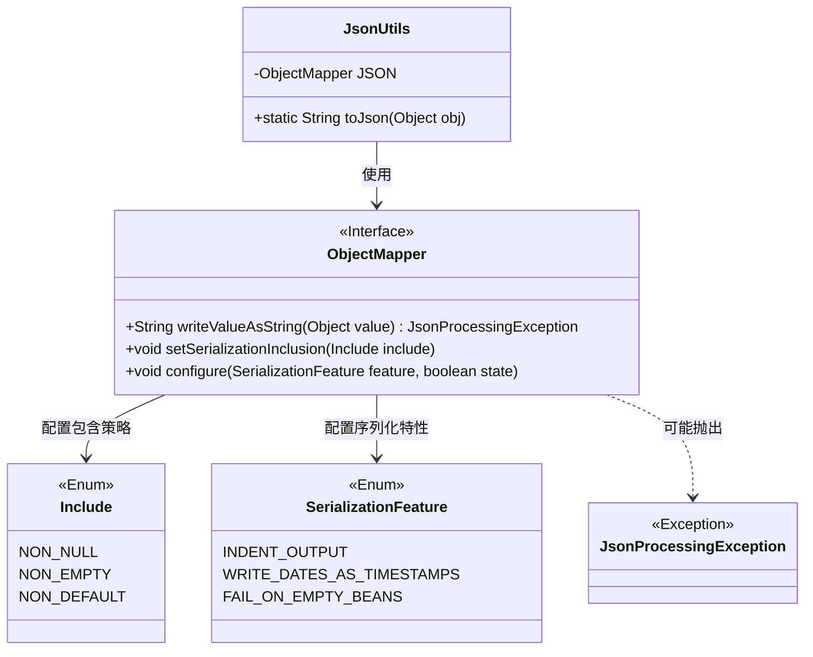
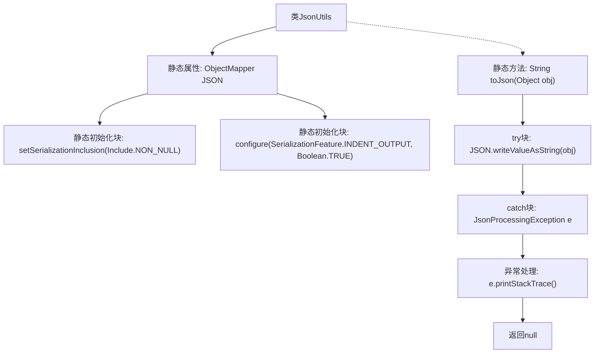

# 基础信息

|      |      |
|------|------|
| 名称 | JsonUtils |
| 编码语言 | .java |
| 代码路径 | weixin-java-miniapp-demo/src/main/java/com/github/binarywang/demo/wx/miniapp/utils/JsonUtils.java |
| 包名 | com.github.binarywang.demo.wx.miniapp.utils |
| 依赖项 | ['com.fasterxml.jackson.annotation.JsonInclude.Include', 'com.fasterxml.jackson.core.JsonProcessingException', 'com.fasterxml.jackson.databind.ObjectMapper', 'com.fasterxml.jackson.databind.SerializationFeature'] |
| 概述说明 | JsonUtils类提供静态JSON序列化方法。它使用Jackson ObjectMapper，配置为忽略空值和格式化输出。toJson方法将对象转为JSON字符串，异常时打印错误并返回null。 |

# 说明

这是一个名为JsonUtils的Java工具类，主要用于将Java对象转换为JSON格式字符串。它内部使用了一个静态的ObjectMapper实例，并进行了初始化配置，该配置会忽略对象中的空值字段，并使生成的JSON字符串具有缩进格式以提高可读性。该类提供了一个公开的静态方法toJson，该方法接收一个对象作为参数并返回其JSON字符串表示。如果在转换过程中发生异常，该方法会打印异常堆栈信息并返回空值。

# 类列表 Class Summary

| 名称   | 类型  | 说明 |
|-------|------|-------------|
| JsonUtils | class | 工具类JsonUtils，使用ObjectMapper配置忽略null值和美化输出，提供toJson方法将对象转为JSON字符串，异常时打印错误并返回null。 |

## 类 JsonUtils

|      |      |
|------|------|
| 访问范围 | public |
| 类型 | class |
| 名称 | JsonUtils |
| 说明 | 工具类JsonUtils，使用ObjectMapper配置忽略null值和美化输出，提供toJson方法将对象转为JSON字符串，异常时打印错误并返回null。 |

### UML类图

这段类图描述了JsonUtils工具类的结构。JsonUtils是核心工具类，它持有一个静态的ObjectMapper实例，并提供静态方法toJson用于对象序列化。ObjectMapper作为Jackson库的核心接口，负责JSON序列化操作，其配置依赖于Include枚举（控制序列化包含策略）和SerializationFeature枚举（控制序列化特性）。ObjectMapper的方法在执行过程中可能抛出JsonProcessingException异常，用于处理JSON处理失败的情况。整个设计展示了工具类通过配置第三方库来提供简洁的JSON序列化功能。

### 内部方法调用关系图

这段代码是一个JSON工具类，使用Jackson库的ObjectMapper进行对象序列化。静态初始化块配置JSON序列化时忽略null值并启用格式化输出。toJson方法将对象转换为JSON字符串，若序列化过程中发生JsonProcessingException异常，则打印异常堆栈并返回null。

### 字段列表 Field List

| 名称  | 类型  | 说明 |
|-------|-------|------|
| JSON = new ObjectMapper() | ObjectMapper | 定义ObjectMapper实例JSON，用于JSON数据序列化和反序列化。 |

### 方法列表

| 名称  | 类型  | 说明 |
|-------|-------|------|
| toJson | String | 这是一个Java方法，用于将对象转换为JSON字符串。如果转换失败，它会打印异常堆栈并返回null。 |

