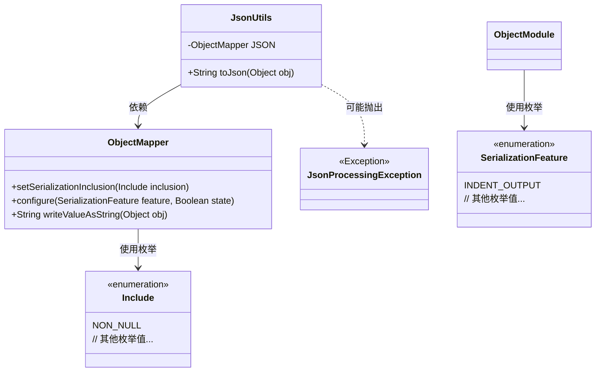
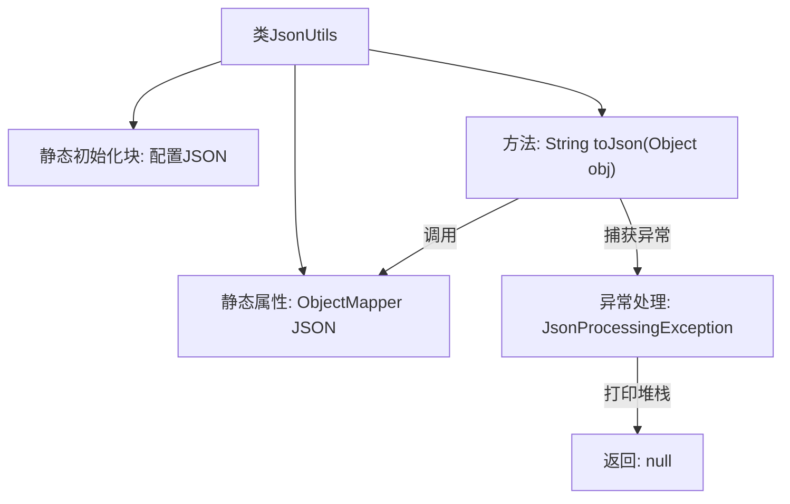

# 基础信息

|      |      |
|------|------|
| 名称 | JsonUtils |
| 编码语言 | .java |
| 代码路径 | weixin-java-miniapp-demo/src/main/java/com/github/binarywang/demo/wx/miniapp/utils/JsonUtils.java |
| 包名 | com.github.binarywang.demo.wx.miniapp.utils |
| 依赖项 | ['com.fasterxml.jackson.annotation.JsonInclude.Include', 'com.fasterxml.jackson.core.JsonProcessingException', 'com.fasterxml.jackson.databind.ObjectMapper', 'com.fasterxml.jackson.databind.SerializationFeature'] |
| 概述说明 | JsonUtils类提供静态方法toJson，使用ObjectMapper将对象转为JSON字符串，自动忽略null值并格式化输出。异常时返回null。 |

# 说明

这是一个名为JsonUtils的工具类，主要用于处理JSON数据转换。类中包含一个静态的ObjectMapper实例JSON，在静态初始化块中配置了序列化时忽略null值，并启用缩进格式化输出。提供了toJson方法，将任意对象转换为JSON字符串，若转换失败则打印异常并返回null。整个类封装了基本的JSON序列化功能，便于其他代码调用。

# 类列表 Class Summary

| 名称   | 类型  | 说明 |
|-------|------|-------------|
| JsonUtils | class | JsonUtils类提供静态方法toJson，使用ObjectMapper将对象转为JSON字符串，自动忽略null值并格式化输出。 |

## 类 JsonUtils

|      |      |
|------|------|
| 访问范围 | public |
| 类型 | class |
| 名称 | JsonUtils |
| 说明 | JsonUtils类提供静态方法toJson，使用ObjectMapper将对象转为JSON字符串，自动忽略null值并格式化输出。 |

### UML类图

这段类图展示了JsonUtils工具类的结构及其相关依赖。JsonUtils使用ObjectMapper进行JSON序列化操作，通过静态初始化块配置了忽略null值和缩进输出的特性。类图中包含了ObjectMapper、Include枚举、SerializationFeature枚举以及可能抛出的JsonProcessingException异常，清晰地呈现了JSON序列化过程中的核心组件和异常处理机制。

### 内部方法调用关系图

流程图描述了JsonUtils类的结构和工作流程。该类包含一个静态ObjectMapper实例JSON，在静态初始化块中配置了非空值序列化和缩进输出。核心方法toJson通过JSON实例将对象转换为字符串，异常时打印堆栈并返回null。流程清晰展示了从方法调用到结果返回/异常处理的完整路径。

### 字段列表 Field List

| 名称  | 类型  | 说明 |
|-------|-------|------|
| JSON = new ObjectMapper() | ObjectMapper | 创建静态不可变JSON对象映射器实例。 |

### 方法列表

| 名称  | 类型  | 说明 |
|-------|-------|------|
| toJson | String | 静态方法toJson将对象转为JSON字符串，异常时打印错误并返回null。 |

