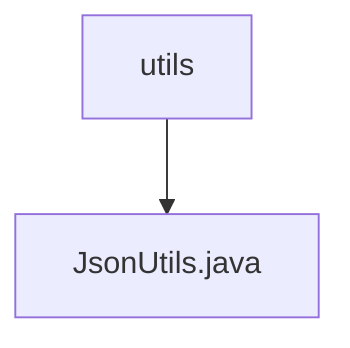

# 基础信息

|      |      |
|------|------|
| 名称 | utils |
| 编码语言 | .java |
| 代码路径 | weixin-java-miniapp-demo/src/main/java/com/github/binarywang/demo/wx/miniapp/utils |
| 包名 | docs.src.main.java.com.github.binarywang.demo.wx.miniapp.utils |
| 概述说明 | JsonUtils类提供静态方法toJson，使用ObjectMapper将对象转为JSON字符串，自动忽略null值并格式化输出。异常时返回null。 |

# 说明

这是一个名为JsonUtils的工具类，主要用于处理JSON数据转换。类中包含一个静态的ObjectMapper实例JSON，在静态初始化块中配置了序列化时忽略null值，并启用缩进格式化输出。提供了toJson方法，将任意对象转换为JSON字符串，若转换失败则打印异常并返回null。整个类封装了基本的JSON序列化功能，便于其他代码调用。

### 包内部结构视图

该流程图展示了微信小程序demo项目中工具类目录的结构关系。顶层节点为utils文件夹，其下级仅包含一个工具类文件JsonUtils.java。这是一个典型的工具类目录结构，其中JsonUtils.java作为唯一的工具类文件，用于处理JSON相关的工具方法。整个结构简洁明了，符合工具类目录的设计规范。

# 文件列表

| 名称   | 类型  | 说明 |
|-------|------|-------------|
| [JsonUtils.java](JsonUtils.md) | file | JsonUtils类提供静态方法toJson，使用ObjectMapper将对象转为JSON字符串，自动忽略null值并格式化输出。异常时返回null。 |

