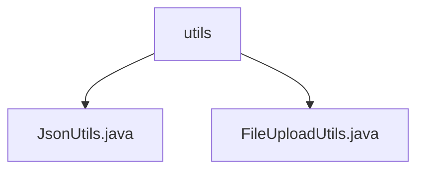

# 基础信息

|      |      |
|------|------|
| 名称 | utils |
| 编码语言 | .java |
| 代码路径 | weixin-java-miniapp-demo/src/main/java/com/github/binarywang/demo/wx/miniapp/utils |
| 包名 | docs.src.main.java.com.github.binarywang.demo.wx.miniapp.utils |
| 概述说明 | JsonUtils工具类处理JSON数据转换，配置忽略null值并格式化输出，提供toJson方法。FileUploadUtils工具类管理文件上传，默认限制50M大小和100字符文件名，支持MinIO桶管理及策略设置。 |

# 说明

## 概述  
该模块提供JSON数据处理和文件上传管理两大核心功能。JsonUtils封装了基于Jackson的JSON序列化能力，支持忽略null值和格式化输出，例如将对象转为易读的JSON字符串。FileUploadUtils实现文件上传全流程管理，类似网盘上传中间件，包含大小校验、MinIO桶策略设置等功能，例如限制文件大小为50MB。  

关键数据结构包括ObjectMapper（JSON序列化配置）、MinIO桶策略（读写权限控制）。外部依赖项为Jackson库和MinIO存储服务。  

## 主要业务场景  
典型应用包括微信小程序后端服务的数据交互场景。JSON序列化用于API响应封装，例如转换Java对象为前端所需JSON格式。文件上传流程涉及校验-转码-存储，例如用户上传头像时触发大小校验和MinIO存储。集成案例展示通过静态工具方法简化调用，如JsonUtils.toJson()一键完成对象序列化。

### 包内部结构视图

该流程图展示了微信小程序demo项目中工具类utils目录下的文件结构。顶层节点为utils文件夹，包含两个工具类文件：JsonUtils.java用于JSON数据处理，FileUploadUtils.java处理文件上传功能。这种简洁的层级关系体现了工具类模块的典型组织方式，便于开发者快速定位常用工具方法。

# 文件列表

| 名称   | 类型  | 说明 |
|-------|------|-------------|
| [JsonUtils.java](JsonUtils.md) | file | JsonUtils类提供静态方法toJson，使用ObjectMapper将对象转为JSON字符串，自动忽略null值并格式化输出。异常时返回null。 |
| [FileUploadUtils.java](FileUploadUtils.md) | file | FileUploadUtils类提供文件上传功能，支持大小和类型校验，默认限制50M和文件名长度100，同时包含MinIO桶管理方法如创建桶、检查存在和设置策略。 |

