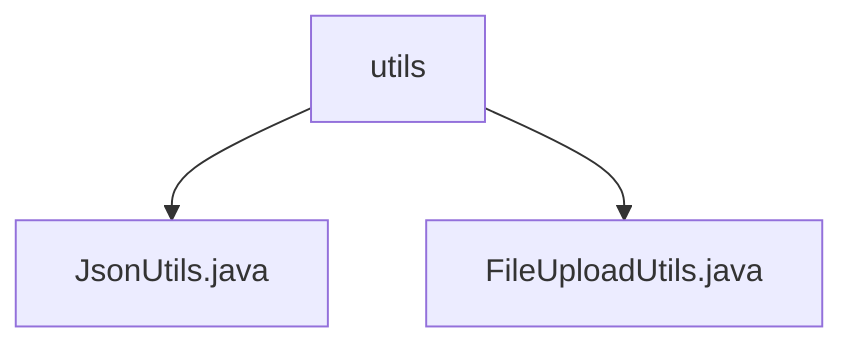

# 基础信息

|      |      |
|------|------|
| 名称 | utils |
| 编码语言 | .java |
| 代码路径 | weixin-java-miniapp-demo/src/main/java/com/github/binarywang/demo/wx/miniapp/utils |
| 包名 | docs.src.main.java.com.github.binarywang.demo.wx.miniapp.utils |
| 概述说明 | JsonUtils工具类提供静态toJson方法将Java对象转为格式化的JSON字符串，忽略空值。FileUploadUtils工具类处理文件上传，支持大小、扩展名校验并生成新文件名，还包含MinIO存储桶管理方法。 |

# 说明

## 概述
这是一个主要由工具类构成的Java模块，核心职责是为上层应用提供数据格式化与文件存储的基础服务。模块接口规范主要围绕静态方法调用展开，例如JsonUtils提供`toJson`对象转换，FileUploadUtils提供包含校验的`upload`文件上传方法。

关键数据结构包括JsonUtils内部配置的ObjectMapper实例，以及FileUploadUtils中定义的文件大小、文件名长度等约束常量。外部依赖项包括Jackson库用于JSON处理，以及MinIO客户端用于对象存储交互。

具体实现案例，例如JsonUtils通过配置ObjectMapper来忽略空值并美化输出；例如FileUploadUtils在上传前会校验文件扩展名并生成带日期路径的新文件名。

## 主要业务场景
模块支持的业务流程主要包含两类：一是将Java对象序列化为格式化的JSON字符串，用于数据交换或日志输出；二是处理文件上传，包括本地路径保存与MinIO对象存储集成，流程中包含完整的校验、重命名和存储操作。

交互模式统一为工具类静态方法调用，功能完整性体现在JsonUtils具备异常处理，FileUploadUtils则融合了本地与云存储双路径。典型应用模式是在Web应用后端接收数据或文件后，调用相应工具进行处理。

整合的API类型主要是工具类方法，集成案例如通过MinIO SDK创建存储桶并设置访问策略，类似于为文件仓库配置管理规则。

### 包内部结构视图

该流程图展示了项目工具类目录的结构关系。`utils`作为根节点文件夹，直接包含两个工具类文件：`JsonUtils.java`和`FileUploadUtils.java`。这两个文件是平级关系，都位于`utils`目录下，共同为项目提供JSON处理和文件上传的功能支持，属于典型的工具类模块组织方式。

# 文件列表

| 名称   | 类型  | 说明 |
|-------|------|-------------|
| [JsonUtils.java](JsonUtils.md) | file | JsonUtils类提供静态JSON序列化方法。它使用Jackson ObjectMapper，配置为忽略空值和格式化输出。toJson方法将对象转为JSON字符串，异常时打印错误并返回null。 |
| [FileUploadUtils.java](FileUploadUtils.md) | file | FileUploadUtils类提供文件上传功能，包含默认配置如文件大小限制50MB和文件名长度限制100字符。支持上传到指定目录并验证文件类型，若超出限制则抛出异常。同时包含MinIO桶管理功能，可检查、创建和配置桶策略。 |

