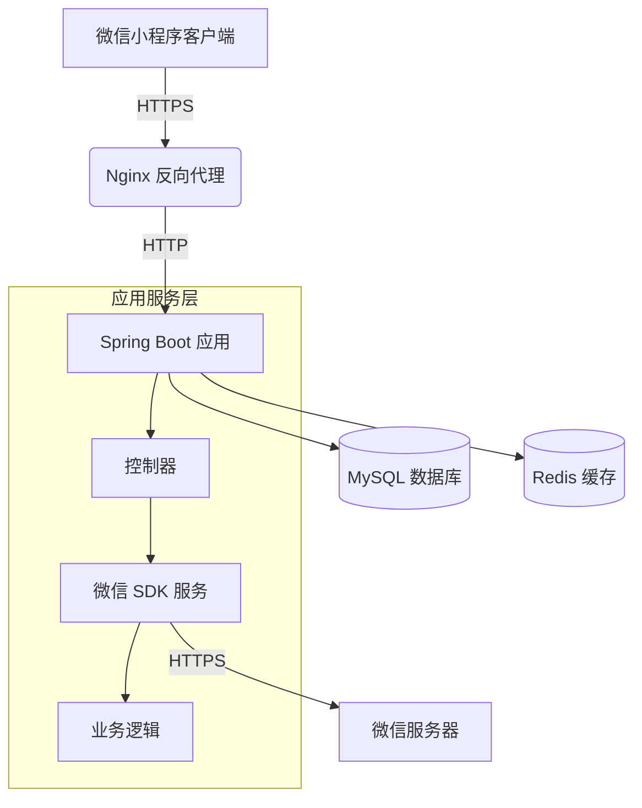

# 系统架构

## 系统概览

本节概述了微信小程序 Java 后端项目的核心功能、业务领域以及所采用的架构模式。

* **项目核心功能与业务领域：** 该项目是一个微信小程序的后端服务，核心功能包括与微信小程序平台的 API 交互、消息服务器配置以及小程序相关业务逻辑处理。业务领域主要围绕微信生态的小程序开发，提供身份验证、消息处理和配置管理等功能。
* **架构模式：** 该项目采用**单体应用**架构模式。
* **架构模式支撑依据：**
    * `Dockerfile` 中仅构建一个单一的 JAR 文件 (`weixin-java-miniapp-demo-1.0.0-SNAPSHOT.jar`)，表明所有功能模块打包为一个独立部署单元。
    * 项目结构中没有 `services/` 或类似微服务划分的目录，所有代码逻辑集中在单一代码库中。
    * 依赖管理文件 (`pom.xml` 虽未直接提供，但 Maven 构建工具的使用和单一 JAR 输出进一步支持单体架构的判断。
    * 配置文件中 (`application.yml.template`) 的配置项集中管理，没有多环境或服务隔离的配置痕迹。

## 核心组件与功能图谱

本节详细阐述了系统的主要组件及其职责，结合微信小程序后端的特点进行合理补充。

* **流量入口层 (Traffic Entry Layer)：**
    * **组件与职责：** 预计使用 Nginx 或类似反向代理作为流量入口，负责 HTTPS 终止、负载均衡和静态资源分发。微信小程序 API 请求通过此层路由到后端服务。
    * **实现考量：** 在单体架构下，通常采用单一入口点将所有流量导向后端应用服务。微信小程序生态强制要求 HTTPS，反向代理需配置 SSL 证书。
* **应用服务层 (Application Service Layer)：**
    * **服务清单与核心功能：**
        * **微信小程序后端服务 (Spring Boot 应用)**：
            * **主要职责：** 处理微信小程序 API 请求，包括用户身份验证 (`wx.login`)、消息推送处理、小程序配置管理等。与微信服务器进行安全交互，验证消息签名，加解密消息内容。
            * **技术基座：** 基于 Java/Spring Boot 框架，利用 `wx-java-miniapp` SDK 实现微信小程序 API 封装。Spring Boot 提供了快速开发、内嵌服务器和配置简化的优势。
            * **内部结构洞察：** 虽然没有完整代码，但根据 Spring Boot 惯例和微信 SDK 使用模式，可推测存在以下模块：
                * `controller/`: 定义 RESTful 端点处理微信 API 回调和小程序业务请求。
                * `service/`: 核心业务逻辑，如消息处理、配置管理。
                * `config/`: Spring 配置类，初始化微信 SDK 和安全性设置。
    * **异步任务与后台处理：** 当前架构未显示明确的异步处理组件（如消息队列或 Celery）。但微信小程序场景中，可能需要异步处理模板消息推送或数据分析任务，未来可引入 Spring 的 `@Async` 或集成 RabbitMQ。
* **数据管理层 (Data Management Layer)：**
    * **数据存储组件识别与职责：**
        * **关系型数据库 (如 MySQL/PostgreSQL):** 存储用户会话信息、小程序配置和业务数据。微信小程序的 `openid` 和 `session_key` 需要安全存储。
        * **Redis 缓存:** 用于会话状态管理 (`wx.login` 的 `session_key` 缓存)、API 调用频率限制。微信接口调用有频率限制，缓存可优化性能。
    * **数据职责与选型考量：** 关系型数据库适合结构化数据存储和复杂查询，Redis 提供高性能的键值存储和过期机制，适合会话管理。微信生态的数据敏感性要求加密存储和传输。

## 容器配置概览

本节列出了通过分析部署文件识别的容器化服务配置。

| 服务名称 (Service Name) | 容器镜像 (Container Image) | 暴露端口 (Exposed Ports) | 挂载卷 (Volumes) | 关键环境变量 (Key Env Vars) | 启动命令/入口点 (Startup Command/Entrypoint) |
| :---------------------- | :-------------------------- | :----------------------- | :--------------- | :-------------------------- | :------------------------------------------- |
| `wx-miniapp-service`    | `openjdk:8-jdk-alpine` (构建自 Dockerfile) | 未明确，通常 `8080` | `/tmp` 匿名卷 | 通过 `application.yml` 配置: `wx.miniapp.configs` (appid, secret, token, aesKey) | `java -Djava.security.egd=file:/dev/./urandom -jar /app.jar` |

## 服务间协作与数据流转

本节描述了系统内部组件和外部用户之间的数据流动与交互模式。

* **核心通信路径：**
    1. 微信小程序客户端发起 HTTPS 请求到后端 API。
    2. 反向代理 (Nginx) 路由请求到 Spring Boot 应用。
    3. 应用处理请求，可能需要查询数据库或缓存微信会话信息。
    4. 对于需要调用微信服务器的操作 (如发送模板消息)，应用通过 HTTPS 与微信 API 交互。
* **交互模式与协议：**
    * 外部通信: HTTPS RESTful API (微信小程序强制要求)。
    * 内部服务: 单体架构，组件间通过方法调用直接交互。
    * 微信服务器: 使用微信定义的 HTTPS 接口，消息加密采用 AES。
* **共享与隔离：** 单体架构共享单一数据库，通过 Schema 设计或表前缀隔离不同模块数据。缓存使用命名空间区分不同用途的数据。

## 整体架构概览图 (Mermaid 语法)

## 架构师核心洞察与未来展望

本节深入分析了架构的关键考量点和未来演进方向。

* **弹性与扩展性策略：** 当前单体架构可通过垂直扩展 (提升实例配置) 应对初期负载。随着用户增长，可考虑将高频率组件 (如会话管理) 拆分为独立服务，实现水平扩展。
* **高可用性与韧性设计：** 建议多实例部署 Spring Boot 应用，结合 Nginx 负载均衡。数据库配置主从复制，Redis 启用哨兵模式。微信 SDK 需实现重试机制应对接口限流。
* **安全防御体系：** 关键点包括:
    * 微信敏感信息 (secret, aesKey) 通过环境变量或秘密管理工具注入。
    * 小程序通信启用 HTTPS，消息体加密。
    * 数据库连接使用 SSL，敏感字段加密存储。
* **运维可观测性与自动化：** 集成 Spring Boot Actuator 提供健康检查，结合 Prometheus/Grafana 监控 JVM 和接口性能。`.travis.yml` 显示基础 CI，可扩展至 Kubernetes 部署。
* **性能优化潜力：** 重点优化微信接口调用 (批量请求、缓存 access_token)。数据库索引优化，高频查询考虑 Redis 缓存。
* **技术栈合理性评估：** Spring Boot 适合快速开发微信生态整合，Java 类型安全有利于敏感数据处理。长期可评估 Kotlin 或 Quarkus 提升性能。
* **未来演进路径与技术引入：**
    * 用户增长后拆分为微服务: 认证服务、消息处理服务、管理 API 服务。
    * 引入消息队列 (RabbitMQ/Kafka) 处理异步事件 (如数据分析、通知)。
    * 对于复杂业务流，考虑领域驱动设计 (DDD) 重构内部架构。

