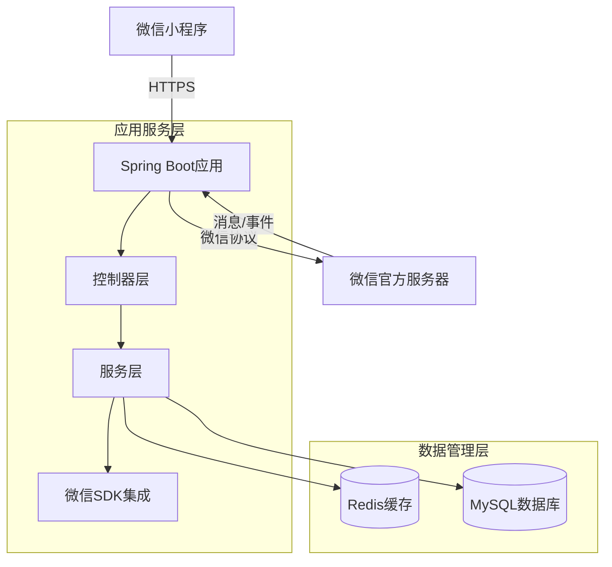

# 系统架构

## 系统概览

该后端项目是一个基于微信小程序生态的Java后端服务，专注于为微信小程序提供核心API支持和消息服务器功能。项目采用单体应用架构模式，通过Spring Boot框架实现快速开发和部署。

* **项目核心功能与业务领域：**  
  核心功能围绕微信小程序开发生态展开，包括小程序用户认证、消息处理、API接口服务等。业务领域属于社交平台服务，为小程序开发者提供后端支持。

* **架构模式：**  
  采用**单体应用**架构模式，基于以下关键依据：
    * 单一Dockerfile构建完整应用，生成单个可执行JAR包
    * 应用配置集中管理于单个application.yml文件
    * 项目结构显示为传统Maven单体项目布局
    * 无微服务间通信或服务发现机制的相关配置
    * 构建流程通过单一Maven命令完成整个应用打包

## 核心组件与功能图谱

系统采用典型的三层架构设计，各层组件职责明确，技术选型符合Java生态最佳实践。

* **流量入口层 (Traffic Entry Layer)：**
    * **组件与职责：**  
      预期部署中可能包含Nginx作为反向代理，处理HTTPS终止、负载均衡和静态资源服务。实际项目中，Spring Boot内嵌Tomcat直接暴露HTTP服务。
    * **实现考量：**  
      生产环境建议前置API网关处理认证、限流等横切关注点，当前配置适合开发测试环境直接访问。

* **应用服务层 (Application Service Layer)：**
    * **服务清单与核心功能：**
        * **微信小程序集成服务**  
          **主要职责：** 处理小程序API调用、消息服务器验证、用户会话管理  
          **技术基座：** Java 8 + Spring Boot + WxJava SDK  
          **内部结构洞察：** 典型Spring MVC分层：
            - Controller层处理HTTP端点
            - Service层实现业务逻辑
            - 集成wx-java-miniapp组件处理微信协议
        * **配置管理服务**  
          **主要职责：** 集中管理小程序凭证等敏感配置  
          **技术基座：** Spring Boot配置体系，支持多环境配置

    * **异步任务与后台处理：**  
      当前架构未显式包含异步处理组件，但微信消息处理场景存在潜在异步需求，建议未来引入：
        - 消息异步持久化
        - 事件驱动架构处理用户行为分析
        - 定时任务刷新微信access_token

* **数据管理层 (Data Management Layer)：**
    * **数据存储组件识别与职责：**  
      当前配置未显式定义数据存储，但微信小程序后端典型需要：
        - **Redis**: 会话缓存、API调用频率控制
        - **MySQL**: 用户数据持久化、业务数据存储
        - **MongoDB**(可选): 非结构化消息数据存储
    * **数据职责与选型考量：**  
      微信生态集成特点决定：
        - 高频读操作需要低延迟缓存
        - 用户数据需要ACID保证
        - 消息数据适合灵活schema

## 容器配置概览

系统采用轻量级容器化部署方案，符合云原生12要素应用原则。

| 服务名称 | 容器镜像 | 暴露端口 | 挂载卷 | 关键环境变量 | 启动命令/入口点 |
|---------|----------|---------|-------|-------------|----------------|
| 微信小程序服务 | openjdk:8-jdk-alpine构建 | 默认8080 | /tmp临时卷 | 通过JVM参数配置安全随机数 | java -jar /app.jar |

## 服务间协作与数据流转

系统数据流遵循微信小程序开发生态标准协议，内部采用高效进程内通信。

* **核心通信路径：**  
  1. 小程序客户端 → HTTPS → Spring Boot应用
  2. 应用 ↔ 微信服务器(API调用/消息推送)
  3. 应用 ↔ 数据存储(配置/业务数据)

* **交互模式与协议：**  
  - 外部: HTTPS + 微信自定义协议
  - 内部: Spring组件间方法调用
  - 数据访问: JDBC/JPA(关系型), Redis客户端(缓存)

* **共享与隔离：**  
  单体架构共享所有组件内存空间，通过Spring IoC容器管理依赖。配置隔离通过profile机制实现。

## 整体架构概览图 (Mermaid 语法)

## 架构师核心洞察与未来展望

当前架构体现了微信生态集成的典型实现，在快速迭代和简单运维方面具有优势。

* **弹性与扩展性策略：**  
  当前无状态设计支持水平扩展，建议：
  - 增加Redis集群支持分布式会话
  - 实现数据库读写分离
  - 引入Spring Cloud组件渐进式改造

* **高可用性与韧性设计：**  
  需加强的方面：
  - 微信access_token集群同步
  - 消息处理幂等设计
  - 断路器模式保护微信API调用

* **安全防御体系：**  
  关键强化点：
  - 小程序签名验证加固
  - 敏感配置Vault集成
  - 请求参数安全过滤

* **运维可观测性与自动化：**  
  建议补充：
  - Spring Boot Actuator监控端点
  - Prometheus指标收集
  - 日志ELK集中管理

* **性能优化潜力：**  
  重点关注：
  - 微信API响应缓存
  - 连接池优化
  - 热点数据本地缓存

* **技术栈合理性评估：**  
  Java 8技术栈成熟稳定，建议：
  - 评估Java 11 LTS升级收益
  - 考虑GraalVM原生镜像构建
  - 渐进式引入Kotlin增强开发效率

* **未来演进路径：**  
  微信生态深度集成方向：
  - 小程序+公众号+支付全渠道整合
  - 微信云开发混合架构
  - 小程序Serverless化支持

